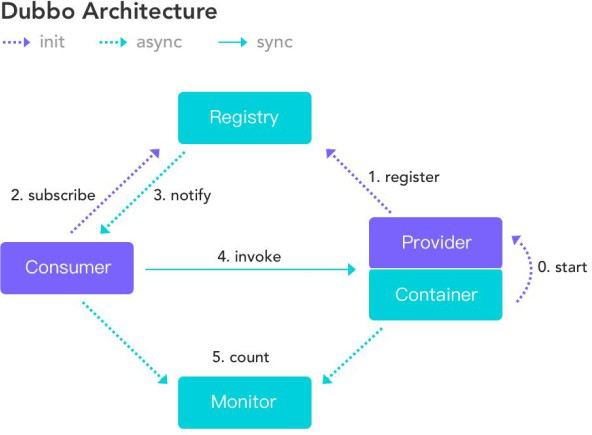

# Dubbo 面试题


~~[说明：提供正版免费激活下载，以及激活工具和教程，点击获取](http://www.idejihuo.com)~~

[](http://www.idejihuo.com)

- [Dubbo 面试题](#dubbo-面试题)
  - [目录](#目录)
    - [1、为什么要用 Dubbo？](#1为什么要用-dubbo)
    - [2、Dubbo 的整体架构设计有哪些分层?](#2dubbo-的整体架构设计有哪些分层)
    - [3、默认使用的是什么通信框架，还有别的选择吗?](#3默认使用的是什么通信框架还有别的选择吗)
    - [4、服务调用是阻塞的吗？](#4服务调用是阻塞的吗)
    - [5、一般使用什么注册中心？还有别的选择吗？](#5一般使用什么注册中心还有别的选择吗)
    - [6、默认使用什么序列化框架，你知道的还有哪些？](#6默认使用什么序列化框架你知道的还有哪些)
    - [7、服务提供者能实现失效踢出是什么原理？](#7服务提供者能实现失效踢出是什么原理)
    - [8、服务上线怎么不影响旧版本？](#8服务上线怎么不影响旧版本)
    - [9、如何解决服务调用链过长的问题？](#9如何解决服务调用链过长的问题)
    - [10、说说核心的配置有哪些？](#10说说核心的配置有哪些)
    - [12、同一个服务多个注册的情况下可以直连某一个服务吗？](#12同一个服务多个注册的情况下可以直连某一个服务吗)
    - [13、画一画服务注册与发现的流程图？](#13画一画服务注册与发现的流程图)
    - [14、Dubbo 集群容错有几种方案？](#14dubbo-集群容错有几种方案)
    - [15、Dubbo 服务降级，失败重试怎么做？](#15dubbo-服务降级失败重试怎么做)
    - [16、Dubbo 使用过程中都遇到了些什么问题？](#16dubbo-使用过程中都遇到了些什么问题)
    - [17、Dubbo Monitor 实现原理？](#17dubbo-monitor-实现原理)
    - [18、Dubbo 用到哪些设计模式？](#18dubbo-用到哪些设计模式)
    - [19、Dubbo 配置文件是如何加载到 Spring 中的？](#19dubbo-配置文件是如何加载到-spring-中的)
    - [20、Dubbo SPI 和 Java SPI 区别？](#20dubbo-spi-和-java-spi-区别)


---

## 目录


### 1、为什么要用 Dubbo？
随着服务化的进一步发展，服务越来越多，服务之间的调用和依赖关系也越来越复杂，诞生了面向服务的架构体系(SOA)，也因此衍生出了一系列相应的技术，如对服务提供、服务调用、连接处理、通信协议、序列化方式、服务发现、服务路由、日志输出等行为进行封装的服务框架。就这样为分布式系统的服务治理框架就出现了，Dubbo 也就这样产生了。


### 2、Dubbo 的整体架构设计有哪些分层?
- **接口服务层（Service）**：该层与业务逻辑相关，根据 provider 和 consumer 的业务设计对应的接口和实现
- **配置层（Config）**：对外配置接口，以 ServiceConfig 和 ReferenceConfig 为中心
- **服务代理层（Proxy）**：服务接口透明代理，生成服务的客户端 Stub 和 服务端的 Skeleton，以 ServiceProxy 为中心，扩展接口为ProxyFactory
- **服务注册层（Registry）**：封装服务地址的注册和发现，以服务 URL 为中心，扩展接口为 RegistryFactory、Registry、RegistryService
- **路由层（Cluster）**：封装多个提供者的路由和负载均衡，并桥接注册中心，以Invoker 为中心，扩展接口为 Cluster、Directory、Router和 LoadBlancce
- **监控层（Monitor）**：RPC 调用次数和调用时间监控，以 Statistics 为中心，扩展接口为 MonitorFactory、Monitor 和 MonitorService
- **远程调用层（Protocal）**：封装 RPC 调用，以 Invocation 和 Result 为中心，扩展接口为 Protocal、Invoker 和 Exporter
- **信息交换层（Exchange）**：封装请求响应模式，同步转异步。以 Request 和Response 为中心，扩展接口为 Exchanger、ExchangeChannel、ExchangeClient 和 ExchangeServer
- **网络传输层（Transport）**：抽象 mina 和 netty 为统一接口，以 Message 为中心，扩展接口为 Channel、Transporter、Client、Server和 Codec
- **数据序列化层（Serialize）**：可复用的一些工具，扩展接口为 Serialization、ObjectInput、ObjectOutput 和 ThreadPool


### 3、默认使用的是什么通信框架，还有别的选择吗?
默认也推荐使用 netty 框架，还有 mina


### 4、服务调用是阻塞的吗？

默认是阻塞的，可以异步调用，没有返回值的可以这么做。

Dubbo 是基于 NIO 的非阻塞实现并行调用，客户端不需要启动多线程即可完成并行调用多个远程服务，相对多线程开销较小，异步调用会返回一个 Future 对象。


### 5、一般使用什么注册中心？还有别的选择吗？
推荐使用 Zookeeper 作为注册中心，还有 Redis、Multicast、Simple 注册中心，但不推荐。


### 6、默认使用什么序列化框架，你知道的还有哪些？
推荐使用 Hessian 序列化，还有 Duddo、FastJson、Java 自带序列化。


### 7、服务提供者能实现失效踢出是什么原理？
服务失效踢出基于 zookeeper 的临时节点原理。


### 8、服务上线怎么不影响旧版本？
采用多版本开发，不影响旧版本。


### 9、如何解决服务调用链过长的问题？
可以结合 zipkin 实现分布式服务追踪。


### 10、说说核心的配置有哪些？
| 配置	| 配置说明 |
|  ----  | ----  |
|dubbo:service	| 服务配置|
|dubbo:reference | 引用配置|
|dubbo:protocol | 协议配置|
|dubbo:applicatio n | 应用配置|
|dubbo:module | 模块配置|
|dubbo:registry | 注册中心配置|
|dubbo:monitor | 监控中心配置|
|dubbo:provider | 提供方配置|
|dubbo:consumer | 消费方配置|
|dubbo:method | 方法配置|
|dubbo:argument | 参数配置|


11、Dubbo 推荐用什么协议？
- dubbo://（推荐）
- rmi://
- hessian://
- http://
- webservice://
- thrift://
- memcached://
- redis://
- rest://


### 12、同一个服务多个注册的情况下可以直连某一个服务吗？
可以点对点直连，修改配置即可，也可以通过 telnet 直接某个服务。


### 13、画一画服务注册与发现的流程图？

[](http://www.idejihuo.com)


### 14、Dubbo 集群容错有几种方案？


|集群容错方案 | 说明|
|  ----  | ----  |
Failover Cluster | 失败自动切换，自动重试其它服务器（默认）
Failfast Cluster | 快速失败，立即报错，只发起一次调用
Failsafe Cluster | 失败安全，出现异常时，直接忽略
Failback Cluster | 失败自动恢复，记录失败请求，定时重发
Forking Cluster | 并行调用多个服务器，只要一个成功即返回
Broadcast Cluster | 广播逐个调用所有提供者，任意一个报错则报错


### 15、Dubbo 服务降级，失败重试怎么做？
可以通过 dubbo:reference 中设置 mock="return null"。mock 的值也可以修改为 true，然后再跟接口同一个路径下实现一个 Mock 类， 命名规则是 “接口名称+Mock” 后缀。然后在 Mock 类里实现自己的降级逻辑


### 16、Dubbo 使用过程中都遇到了些什么问题？
在注册中心找不到对应的服务,检查 service 实现类是否添加了@service 注解无法连接到注册中心,检查配置文件中的对应的测试 ip 是否正确


### 17、Dubbo Monitor 实现原理？
Consumer 端在发起调用之前会先走 filter 链；provider 端在接收到请求时也是先走 filter 链，然后才进行真正的业务逻辑处理。默认情况下，在 consumer 和 provider 的 filter 链中都会有 Monitorfilter。
1、MonitorFilter 向 DubboMonitor 发送数据
2、DubboMonitor 将数据进行聚合后（默认聚合 1min 中的统计数据）暂存到ConcurrentMap<Statistics, AtomicReference> statisticsMap，然后使用一个含有 3 个线程（线程名字：DubboMonitorSendTimer）的线程池每隔 1min 钟，调用SimpleMonitorService 遍历发送 statisticsMap 中的统计数据，每发送完毕一个，就重置当前的 Statistics 的 AtomicReference 3、SimpleMonitorService 将这些聚合数据塞入 BlockingQueue queue 中（队列大写为 100000）
4、SimpleMonitorService 使用一个后台线程（线程名为：DubboMonitorAsyncWriteLogThread）将 queue  中的数据写入文件（该线程以死循环的形式来写）
5、SimpleMonitorService 还会使用一个含有 1 个线程（线程名字：DubboMonitorTimer）的线程池每隔 5min 钟，将文件中的统计数据画成图表


### 18、Dubbo 用到哪些设计模式？
Dubbo 框架在初始化和通信过程中使用了多种设计模式，可灵活控制类加载、权限控制等功能。

**工厂模式**

Provider 在 export 服务时，会调用 ServiceConfig 的 export 方法。ServiceConfig中有个字段：
```
private static final Protocol protocol = ExtensionLoader.getExtensionLoader(Protocol.class).getAdaptiveExtension();
```

Dubbo 里有很多这种代码。这也是一种工厂模式，只是实现类的获取采用了 JDKSPI 的机制。这么实现的优点是可扩展性强，想要扩展实现，只需要在 classpath下增加个文件就可以了，代码零侵入。另外，像上面的 Adaptive 实现，可以做到调用时动态决定调用哪个实现， 但是由于这种实现采用了动态代理，会造成代码调试比较麻烦，需要分析出实际调用的实现类。

**装饰器模式**

Dubbo 在启动和调用阶段都大量使用了装饰器模式。以 Provider 提供的调用链为例，具体的调用链代码是在 ProtocolFilterWrapper 的 buildInvokerChain 完成的，具体是将注解中含有 group=provider 的 Filter 实现，按照 order 排序，最后的调用顺序是：
Dubbo 里有很多这种代码。这也是一种工厂模式，只是实现类的获取采用了 JDKSPI 的机制。这么实现的优点是可扩展性强，想要扩展实现，只需要在 classpath下增加个文件就可以了，代码零侵入。另外，像上面的 Adaptive 实现，可以做到调用时动态决定调用哪个实现， 但是由于这种实现采用了动态代理，会造成代码调试比较麻烦，需要分析出实际调用的实现类。

**装饰器模式**

Dubbo 在启动和调用阶段都大量使用了装饰器模式。以 Provider 提供的调用链为例，具体的调用链代码是在 ProtocolFilterWrapper 的 buildInvokerChain 完成的，具体是将注解中含有 group=provider 的 Filter 实现，按照 order 排序，最后的调用顺序是：
```
EchoFilter -> ClassLoaderFilter -> GenericFilter -> ContextFilter -> ExecuteLimitFilter -> TraceFilter -> TimeoutFilter -> MonitorFilter -> ExceptionFilter
```
更确切地说，这里是装饰器和责任链模式的混合使用。例如，EchoFilter 的作用是判断是否是回声测试请求，是的话直接返回内容，这是一种责任链的体现。而像ClassLoaderFilter 则只是在主功能上添加了功能，更改当前线程的 ClassLoader，这是典型的装饰器模式。

**观察者模式**

Dubbo 的 Provider 启动时，需要与注册中心交互，先注册自己的服务，再订阅自己的服务，订阅时，采用了观察者模式，开启一个listener。注册中心会每 5 秒定时检查是否有服务更新，如果有更新，向该服务的提供者发送一个 notify 消息，provider 接受到 notify 消息后，即运行 NotifyListener 的 notify 方法，执行监听器方法。

**动态代理模式**

Dubbo 扩展 JDK SPI 的类 ExtensionLoader 的 Adaptive 实现是典型的动态代理实现。Dubbo 需要灵活地控制实现类，即在调用阶段动态地根据参数决定调用哪个实现类，所以采用先生成代理类的方法，能够做到灵活的调用。生成代理类的代码是 ```ExtensionLoader``` 的 ```createAdaptiveExtensionClassCode``` 方法。代理类的主要逻辑是，获取 URL 参数中指定参数的值作为获取实现类的 key。


### 19、Dubbo 配置文件是如何加载到 Spring 中的？
Spring 容器在启动的时候，会读取到 Spring 默认的一些 schema 以及 Dubbo 自定义的 schema，每个 schema 都会对应一个自己的 ```NamespaceHandler```，```NamespaceHandler``` 里面通过 ```BeanDefinitionParser``` 来解析配置信息并转化为需要加载的 bean 对象!


### 20、Dubbo SPI 和 Java SPI 区别？

**JDK SPI**

JDK 标准的 SPI 会一次性加载所有的扩展实现，如果有的扩展吃实话很耗时，但也没用上，很浪费资源。所以只希望加载某个的实现，就不现实了

**DUBBO SPI**

1) 对 Dubbo 进行扩展，不需要改动 Dubbo 的源码
2) 延迟加载，可以一次只加载自己想要加载的扩展实现。
3) 增加了对扩展点 IOC 和 AOP 的支持，一个扩展点可以直接 setter 注入其它扩展点。
4) Dubbo 的扩展机制能很好的支持第三方 IoC 容器，默认支持 Spring Bean。


