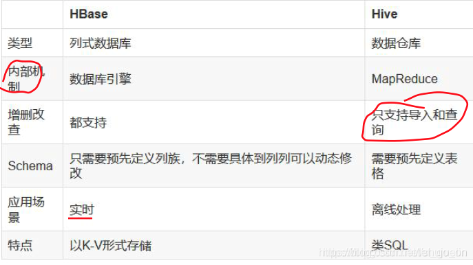
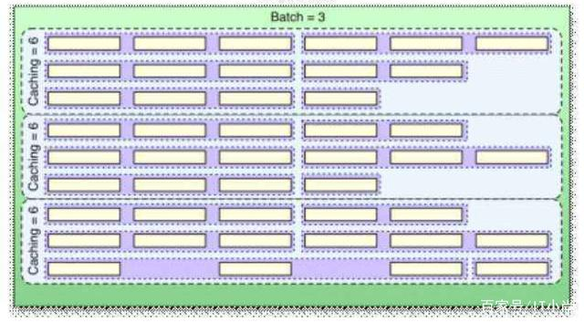

# Hbase面试题

~~[说明：提供正版免费激活下载，以及激活工具和教程，点击获取](http://www.idejihuo.com)~~

[](http://www.idejihuo.com)


- [Hbase面试题](#hbase面试题)
  - [目录](#目录)
    - [HBase概述](#hbase概述)


---

## 目录


### HBase概述

hbase是建立的hdfs之上，提供高可靠性、高性能、列存储、可伸缩、实时读写的数据库系统。

它介于nosql和RDBMS之间，仅能通过主键(row key)和主键的range来检索数据，仅支持单行事务(可通过hive支持来实现多表join等复杂操作)。主要用来存储非结构化和半结构化的松散数据。

与hadoop一样，Hbase目标主要依靠横向扩展，通过不断增加廉价的商用服务器，来增加计算和存储能力。

HBase中的表一般有这样的特点：

1 大：一个表可以有上亿行，上百万列

2 面向列:面向列(族)的存储和权限控制，列(族)独立检索。

3 稀疏:对于为空(null)的列，并不占用存储空间，因此，表可以设计的非常稀疏。


### 1、Hbase是什么？

- (1) Hbase一个分布式的基于列式存储的数据库,基于Hadoop的hdfs存储，zookeeper进行管理。
- (2) Hbase适合存储半结构化或非结构化数据，对于数据结构字段不够确定或者杂乱无章很难按一个概念去抽取的数据。
- (3) Hbase为null的记录不会被存储.
- (4)基于的表包含rowkey，时间戳，和列族。新写入数据时，时间戳更新，同时可以查询到以前的版本.
- (5) hbase是主从架构。hmaster作为主节点，hregionserver作为从节点。


### 2、HBase 的特点是什么？
- 1）大：一个表可以有数十亿行，上百万列；
- 2）无模式：每行都有一个可排序的主键和任意多的列，列可以根据需要动态的增加，同一张表中不同的行可以有截然不同的列；
- 3）面向列：面向列（族）的存储和权限控制，列（族）独立检索；
- 4）稀疏：空（null）列并不占用存储空间，表可以设计的非常稀疏；
- 5）数据多版本：每个单元中的数据可以有多个版本，默认情况下版本号自动分配，是单元格插入时的时间戳；
- 6）数据类型单一：Hbase 中的数据都是字符串，没有类型。


### 3、HBase 和 Hive 的区别？

[](http://www.idejihuo.com)

Hive 和 Hbase 是两种基于 Hadoop 的不同技术

Hive 是一种类 SQL 的引擎，并且运行MapReduce 任务，Hbase 是一种在 Hadoop 之上的 NoSQL 的 Key/vale 数据库。当然，这两种工具是可以同时使用的。就像用 Google 来搜索，用 FaceBook 进行社交一样，Hive 可以用来进行统计查询，HBase 可以用来进行实时查询，数据也可以从 Hive 写到 Hbase，设置再从 Hbase 写回 Hive。


### 4、HBase 适用于怎样的情景？
- ① 半结构化或非结构化数据
- ② 记录非常稀疏
- ③ 多版本数据
- ④ 超大数据量


### 5、描述 HBase 的 rowKey 的设计原则？

- ***① Rowkey 长度原则***

Rowkey 是一个二进制码流，Rowkey 的长度被很多开发者建议说设计在 10~100 个字节，不过建议是越短越好，不要超过 16 个字节。

原因如下：
1) 数据的持久化文件 HFile 中是按照 KeyValue 存储的，如果 Rowkey 过长比如 100个字节，1000 万列数据光 Rowkey 就要占用 100*1000 万=10 亿个字节，将近 1G 数据，这会极大影响 HFile 的存储效率；
2) MemStore 将缓存部分数据到内存，如果 Rowkey 字段过长内存的有效利用率会降低，系统将无法缓存更多的数据，这会降低检索效率。因此 Rowkey 的字节长度越短越好。
3) 目前操作系统是都是 64 位系统，内存 8 字节对齐。控制在 16 个字节，8 字节的整数倍利用操作系统的最佳特性。

- ***② Rowkey 散列原则***

如果Rowkey 是按时间戳的方式递增，不要将时间放在二进制码的前面，建议将Rowkey的高位作为散列字段，由程序循环生成，低位放时间字段，这样将提高数据均衡分布在每个Regionserver 实现负载均衡的几率。如果没有散列字段，首字段直接是时间信息将产生所有新数据都在一个 RegionServer 上堆积的热点现象，这样在做数据检索的时候负载将会集中在个别 RegionServer，降低查询效率。

- ***③ Rowkey 唯一原则***

必须在设计上保证其唯一性。


### 6、描述 HBase 中 scan 和 get 的功能以及实现的异同？
HBase 的查询实现只提供两种方式：
1) 按指定 RowKey 获取唯一一条记录，get 方法（``org.apache.hadoop.hbase.client.Get``）Get 的方法处理分两种 : 设置了 ClosestRowBefore 和没有设置 ClosestRowBefore 的rowlock。主要是用来保证行的事务性，即每个 get 是以一个 row 来标记的。一个 row 中可以有很多 family 和 column。
2) 按指定的条件获取一批记录，scan 方法(``org.apache.Hadoop.hbase.client.Scan``）实现条件查询功能使用的就是 scan 方式。


### 7、 简述 HBase 中 compact 用途是什么，什么时候触发，分为哪两种，有什么区别，有哪些相关配置参数？（☆☆☆☆☆）

在 hbase 中每当有 memstore 数据 flush 到磁盘之后，就形成一个 storefile，当 storeFile的数量达到一定程度后，就需要将 storefile 文件来进行 compaction 操作。

Compact 的作用：

① 合并文件
② 清除过期，多余版本的数据
③ 提高读写数据的效率

HBase 中实现了两种 compaction 的方式：minor and major. 这两种 compaction 方式的区别是：

1、Minor 操作只用来做部分文件的合并操作以及包括 minVersion=0 并且设置 ttl 的过期版本清理，不做任何删除数据、多版本数据的清理工作。

2、Major 操作是对 Region 下的 HStore 下的所有 StoreFile 执行合并操作，最终的结果是整理合并出一个文件。


### 8、HBase 优化？
（1）高可用
在 HBase 中 Hmaster 负责监控 RegionServer 的生命周期，均衡 RegionServer 的负载，如果 Hmaster 挂掉了，那么整个 HBase 集群将陷入不健康的状态，并且此时的工作状态并不会维持太久。所以 HBase 支持对 Hmaster 的高可用配置。

（2）预分区
每一个 region 维护着 startRow 与 endRowKey，如果加入的数据符合某个 region 维护的 rowKey 范围，则该数据交给这个 region 维护。那么依照这个原则，我们可以将数据所要投放的分区提前大致的规划好，以提高 HBase 性能 .

（3）RowKey 设计
一条数据的唯一标识就是 rowkey，那么这条数据存储于哪个分区，取决于 rowkey 处于哪个一个预分区的区间内，设计 rowkey 的主要目的 ，就是让数据均匀的分布于所有的 region 中，在一定程度上防止数据倾斜。接下来我们就谈一谈 rowkey 常用的设计方案

（4）7.4 内存优化
HBase 操作过程中需要大量的内存开销，毕竟 Table 是可以缓存在内存中的，一般会分配整个可用内存的 70%给 HBase 的 Java 堆。但是不建议分配非常大的堆内存，因为 GC 过程持续太久会导致 RegionServer 处于长期不可用状态，一般 16~48G 内存就可以了，如果因为框架占用内存过高导致系统内存不足，框架一样会被系统服务拖死。


### 9、Region 如何预建分区？
预分区的目的主要是在创建表的时候指定分区数，提前规划表有多个分区，以及每个分区的区间范围，这样在存储的时候 rowkey 按照分区的区间存储，可以避免 region 热点问题。

通常有两种方案：

***方案 1:shell 方法***

```create ‘tb_splits’, {NAME => ‘cf’,VERSIONS=> 3},{SPLITS => [‘10’,‘20’,‘30’]}```

***方案 2: JAVA 程序控制***

- 取样，先随机生成一定数量的 rowkey,将取样数据按升序排序放到一个集合里；
- 根据预分区的 region 个数，对整个集合平均分割，即是相关的 splitKeys；
- HBaseAdmin.createTable(HTableDescriptor tableDescriptor,byte[][]splitkeys)可以指定预分区的 splitKey，即是指定 region 间的 rowkey 临界值。


### 10、HRegionServer 宕机如何处理？
1) ZooKeeper 会监控 HRegionServer 的上下线情况，当 ZK 发现某个 HRegionServer 宕机之后会通知 HMaster 进行失效备援；
2) 该 HRegionServer 会停止对外提供服务，就是它所负责的 region 暂时停止对外提供服务；
3) HMaster 会将该 HRegionServer 所负责的 region 转移到其他 HRegionServer 上，并且会对 HRegionServer 上存在 memstore 中还未持久化到磁盘中的数据进行恢复；
4) 这个恢复的工作是由 WAL 重播来完成，这个过程如下：
- wal 实际上就是一个文件，存在/hbase/WAL/对应 RegionServer 路径下。
- 宕机发生时，读取该 RegionServer 所对应的路径下的 wal 文件，然后根据不同的region 切分成不同的临时文件 recover.edits。
- 当 region 被分配到新的 RegionServer 中，RegionServer 读取 region 时会进行是否存在 recover.edits，如果有则进行恢复。


### 11、HBase 读写流程？
***读：***
- ① HRegionServer 保存着 meta 表以及表数据，要访问表数据，首先 Client 先去访问zookeeper，从 zookeeper 里面获取 meta 表所在的位置信息，即找到这个 meta 表在哪个HRegionServer 上保存着。
- ② 接着 Client 通过刚才获取到的 HRegionServer 的 IP 来访问 Meta 表所在的HRegionServer，从而读取到 Meta，进而获取到 Meta 表中存放的元数据。
- ③ Client 通过元数据中存储的信息，访问对应的 HRegionServer，然后扫描所在HRegionServer 的 Memstore 和 Storefile 来查询数据。
- ④ 最后 HRegionServer 把查询到的数据响应给 Client。

***写：***
- ① Client 先访问 zookeeper，找到 Meta 表，并获取 Meta 表元数据。
- ② 确定当前将要写入的数据所对应的 HRegion 和 HRegionServer 服务器。
- ③ Client 向该 HRegionServer 服务器发起写入数据请求，然后 HRegionServer 收到请求并响应。
- ④ Client 先把数据写入到 HLog，以防止数据丢失。
- ⑤ 然后将数据写入到 Memstore。
- ⑥ 如果 HLog 和 Memstore 均写入成功，则这条数据写入成功
- ⑦ 如果 Memstore 达到阈值，会把 Memstore 中的数据 flush 到 Storefile 中。
- ⑧ 当 Storefile 越来越多，会触发 Compact 合并操作，把过多的 Storefile 合并成一个大的 Storefile。
- ⑨ 当 Storefile 越来越大，Region 也会越来越大，达到阈值后，会触发 Split 操作，将Region 一分为二。


### 12、如何提高 HBase 客户端的读写性能？请举例说明（☆☆☆☆☆）
- 1 开启 bloomfilter 过滤器，开启 bloomfilter 比没开启要快 3、4 倍
- 2 Hbase 对于内存有特别的需求，在硬件允许的情况下配足够多的内存给它
- 3 通过修改 hbase-env.sh 中的export HBASE_HEAPSIZE=3000 #这里默认为 1000m
- 4 增大 RPC 数量通过修改 hbase-site.xml 中的 hbase.regionserver.handler.count 属性，可以适当的放大RPC 数量，默认值为 10 有点小。

### 13、直接将时间戳作为行健，在写入单个 region 时候会发生热点问题，为什么呢？（☆☆☆☆☆）
region 中的 rowkey 是有序存储，若时间比较集中。就会存储到一个 region 中，这样一个 region 的数据变多，其它的 region 数据很少，加载数据就会很慢，直到 region 分裂，此问题才会得到缓解。


### 14、hbase如何导入数据？
通过HBase API进行批量写入数据；
使用Sqoop工具批量导数到HBase集群；
使用MapReduce批量导入；
HBase BulkLoad的方式。


### 15、hbase 的存储结构？
Hbase 中的每张表都通过行键 (rowkey) 按照一定的范围被分割成多个子表（HRegion），默认一个 HRegion 超过 256M 就要被分割成两个，由 HRegionServer 管理，管理哪些 HRegion 由 Hmaster 分配。 HRegion 存取一个子表时，会创建一个 HRegion 对象，然后对表的每个列族 （Column Family） 创建一个 store 实例， 每个 store 都会有 0个或多个 StoreFile 与之对应，每个 StoreFile 都会对应一个 HFile ， HFile 就是实际的存储文件，因此，一个 HRegion 还拥有一个 MemStore 实例。


### 16、解释下 hbase 实时查询的原理
实时查询，可以认为是从内存中查询，一般响应时间在 1 秒内。HBase 的机制是数据先写入到内存中，当数据量达到一定的量（如 128M），再写入磁盘中， 在内存中，是不进行数据的更新或合并操作的，只增加数据，这使得用户的写操作只要进入内存中就可以立即返回，保证了 HBase I/O 的高性能。


### 17、HBase优化方法
优化手段主要有以下四个方面

减少调整
减少调整这个如何理解呢？HBase中有几个内容会动态调整，如region（分区）、HFile，所以通过一些方法来减少这些会带来I/O开销的调整

Region
如果没有预建分区的话，那么随着region中条数的增加，region会进行分裂，这将增加I/O开销，所以解决方法就是根据你的RowKey设计来进行预建分区，减少region的动态分裂。

HFile
HFile是数据底层存储文件，在每个memstore进行刷新时会生成一个HFile，当HFile增加到一定程度时，会将属于一个region的HFile进行合并，这个步骤会带来开销但不可避免，但是合并后HFile大小如果大于设定的值，那么HFile会重新分裂。为了减少这样的无谓的I/O开销，建议估计项目数据量大小，给HFile设定一个合适的值

减少启停
数据库事务机制就是为了更好地实现批量写入，较少数据库的开启关闭带来的开销，那么HBase中也存在频繁开启关闭带来的问题。

关闭Compaction，在闲时进行手动Compaction

因为HBase中存在Minor Compaction和Major Compaction，也就是对HFile进行合并，所谓合并就是I/O读写，大量的HFile进行肯定会带来I/O开销，甚至是I/O风暴，所以为了避免这种不受控制的意外发生，建议关闭自动Compaction，在闲时进行compaction

批量数据写入时采用BulkLoad

如果通过HBase-Shell或者JavaAPI的put来实现大量数据的写入，那么性能差是肯定并且还可能带来一些意想不到的问题，所以当需要写入大量离线数据时建议使用BulkLoad

减少数据量
虽然我们是在进行大数据开发，但是如果可以通过某些方式在保证数据准确性同时减少数据量，何乐而不为呢？

开启过滤，提高查询速度
开启BloomFilter，BloomFilter是列族级别的过滤，在生成一个StoreFile同时会生成一个MetaBlock，用于查询时过滤数据

使用压缩：一般推荐使用Snappy和LZO压缩

合理设计
在一张HBase表格中RowKey和ColumnFamily的设计是非常重要，好的设计能够提高性能和保证数据的准确性

RowKey设计：应该具备以下几个属性
散列性：散列性能够保证相同相似的rowkey聚合，相异的rowkey分散，有利于查询
简短性：rowkey作为key的一部分存储在HFile中，如果为了可读性将rowKey设计得过长，那么将会增加存储压力
唯一性：rowKey必须具备明显的区别性
业务性：举些例子
假如我的查询条件比较多，而且不是针对列的条件，那么rowKey的设计就应该支持多条件查询
如果我的查询要求是最近插入的数据优先，那么rowKey则可以采用叫上Long.Max-时间戳的方式，这样rowKey就是递减排列
列族的设计

列族的设计需要看应用场景

多列族设计的优劣

优势：
HBase中数据时按列进行存储的，那么查询某一列族的某一列时就不需要全盘扫描，只需要扫描某一列族，减少了读I/O；
其实多列族设计对减少的作用不是很明显，适用于读多写少的场景。

劣势：
降低了写的I/O性能。原因如下：数据写到store以后是先缓存在memstore中，同一个region中存在多个列族则存在多个store，每个store都一个memstore，当其实memstore进行flush时，属于同一个region
的store中的memstore都会进行flush，增加I/O开销。


### 18、为什么不建议在 HBase 中使用过多的列族
在 Hbase 的表中，每个列族对应 Region 中的一个Store，Region的大小达到阈值时会分裂，因此如果表中有多个列族，则可能出现以下现象：

一个Region中有多个Store，如果每个CF的数据量分布不均匀时，比如CF1为100万，CF2为1万，则Region分裂时导致CF2在每个Region中的数据量太少，查询CF2时会横跨多个Region导致效率降低。

如果每个CF的数据分布均匀，比如CF1有50万，CF2有50万，CF3有50万，则Region分裂时导致每个CF在Region的数据量偏少，查询某个CF时会导致横跨多个Region的概率增大。

多个CF代表有多个Store，也就是说有多个MemStore(2MB)，也就导致内存的消耗量增大，使用效率下降。

Region 中的 缓存刷新 和 压缩 是基本操作，即一个CF出现缓存刷新或压缩操作，其它CF也会同时做一样的操作，当列族太多时就会导致IO频繁的问题。


### 19.请描述如何解决 HBase 中 region 太小和 region 太大带来的冲突？

Region 过大会发生多次compaction，将数据读一遍并重写一遍到 hdfs 上，占用io，region过小会造成多次 split，region 会下线，影响访问服务，最佳的解决方法是调整 hbase.hregion.max.filesize 为 256m。


1. Hbase是怎么写数据的？
Client写入 -> 存入MemStore，一直到MemStore满 -> Flush成一个StoreFile，直至增长到一定阈值 -> 触发Compact合并操作 -> 多个StoreFile合并成一个StoreFile，同时进行版本合并和数据删除 -> 当StoreFiles Compact后，逐步形成越来越大的StoreFile -> 单个StoreFile大小超过一定阈值后（默认10G），触发Split操作，把当前Region Split成2个Region，Region会下线，新Split出的2个孩子Region会被HMaster分配到相应的HRegionServer 上，使得原先1个Region的压力得以分流到2个Region上

由此过程可知，HBase只是增加数据，没有更新和删除操作，用户的更新和删除都是逻辑层面的，在物理层面，更新只是追加操作，删除只是标记操作。

用户写操作只需要进入到内存即可立即返回，从而保证I/O高性能。

[](http://www.idejihuo.com)


2. HDFS和HBase各自使用场景
首先一点需要明白：Hbase是基于HDFS来存储的。

HDFS：

一次性写入，多次读取。

保证数据的一致性。

主要是可以部署在许多廉价机器中，通过多副本提高可靠性，提供了容错和恢复机制。

HBase：

瞬间写入量很大，数据库不好支撑或需要很高成本支撑的场景。

数据需要长久保存，且量会持久增长到比较大的场景。

HBase不适用与有 join，多级索引，表关系复杂的数据模型。

大数据量（100s TB级数据）且有快速随机访问的需求。如：淘宝的交易历史记录。数据量巨大无容置疑，面向普通用户的请求必然要即时响应。

业务场景简单，不需要关系数据库中很多特性（例如交叉列、交叉表，事务，连接等等）。

3. Hbase的存储结构
Hbase 中的每张表都通过行键(rowkey)按照一定的范围被分割成多个子表（HRegion），默认一个HRegion 超过256M 就要被分割成两个，由HRegionServer管理，管理哪些 HRegion 由 Hmaster 分配。HRegion 存取一个子表时，会创建一个 HRegion 对象，然后对表的每个列族（Column Family）创建一个 store 实例， 每个 store 都会有 0 个或多个 StoreFile 与之对应，每个 StoreFile 都会对应一个HFile，HFile 就是实际的存储文件，一个 HRegion 还拥有一个 MemStore实例。

4. 热点现象（数据倾斜）怎么产生的，以及解决方法有哪些
热点现象：

某个小的时段内，对HBase的读写请求集中到极少数的Region上，导致这些region所在的RegionServer处理请求量骤增，负载量明显偏大，而其他的RgionServer明显空闲。

热点现象出现的原因：

HBase中的行是按照rowkey的字典顺序排序的，这种设计优化了scan操作，可以将相关的行以及会被一起读取的行存取在临近位置，便于scan。然而糟糕的rowkey设计是热点的源头。

热点发生在大量的client直接访问集群的一个或极少数个节点（访问可能是读，写或者其他操作）。大量访问会使热点region所在的单个机器超出自身承受能力，引起性能下降甚至region不可用，这也会影响同一个RegionServer上的其他region，由于主机无法服务其他region的请求。

热点现象解决办法：

为了避免写热点，设计rowkey使得不同行在同一个region，但是在更多数据情况下，数据应该被写入集群的多个region，而不是一个。常见的方法有以下这些：

加盐：在rowkey的前面增加随机数，使得它和之前的rowkey的开头不同。分配的前缀种类数量应该和你想使用数据分散到不同的region的数量一致。加盐之后的rowkey就会根据随机生成的前缀分散到各个region上，以避免热点。

哈希：哈希可以使负载分散到整个集群，但是读却是可以预测的。使用确定的哈希可以让客户端重构完整的rowkey，可以使用get操作准确获取某一个行数据

反转：第三种防止热点的方法时反转固定长度或者数字格式的rowkey。这样可以使得rowkey中经常改变的部分（最没有意义的部分）放在前面。这样可以有效的随机rowkey，但是牺牲了rowkey的有序性。反转rowkey的例子以手机号为rowkey，可以将手机号反转后的字符串作为rowkey，这样的就避免了以手机号那样比较固定开头导致热点问题

时间戳反转：一个常见的数据处理问题是快速获取数据的最近版本，使用反转的时间戳作为rowkey的一部分对这个问题十分有用，可以用 Long.Max_Value - timestamp 追加到key的末尾，例如[key][reverse_timestamp],[key]的最新值可以通过scan [key]获得[key]的第一条记录，因为HBase中rowkey是有序的，第一条记录是最后录入的数据。
比如需要保存一个用户的操作记录，按照操作时间倒序排序，在设计rowkey的时候，可以这样设计[userId反转] [Long.Max_Value - timestamp]，在查询用户的所有操作记录数据的时候，直接指定反转后的userId，startRow是[userId反转][000000000000],stopRow是[userId反转][Long.Max_Value - timestamp]
如果需要查询某段时间的操作记录，startRow是[user反转][Long.Max_Value - 起始时间]，stopRow是[userId反转][Long.Max_Value - 结束时间]

HBase建表预分区：创建HBase表时，就预先根据可能的RowKey划分出多个region而不是默认的一个，从而可以将后续的读写操作负载均衡到不同的region上，避免热点现象。

5. HBase的 rowkey 设计原则
长度原则：100字节以内，8的倍数最好，可能的情况下越短越好。因为HFile是按照 keyvalue 存储的，过长的rowkey会影响存储效率；其次，过长的rowkey在memstore中较大，影响缓冲效果，降低检索效率。最后，操作系统大多为64位，8的倍数，充分利用操作系统的最佳性能。

散列原则：高位散列，低位时间字段。避免热点问题。

唯一原则：分利用这个排序的特点，将经常读取的数据存储到一块，将最近可能会被访问 的数据放到一块。

6. HBase的列簇设计
原则：在合理范围内能尽量少的减少列簇就尽量减少列簇，因为列簇是共享region的，每个列簇数据相差太大导致查询效率低下。

最优：将所有相关性很强的 key-value 都放在同一个列簇下，这样既能做到查询效率最高，也能保持尽可能少的访问不同的磁盘文件。以用户信息为例，可以将必须的基本信息存放在一个列族，而一些附加的额外信息可以放在另一列族。

7. HBase 中 compact 用途是什么，什么时候触发，分为哪两种，有什么区别
在 hbase 中每当有 memstore 数据 flush 到磁盘之后，就形成一个 storefile，当 storeFile的数量达到一定程度后，就需要将 storefile 文件来进行 compaction 操作。

Compact 的作用：

合并文件

清除过期，多余版本的数据

提高读写数据的效率

HBase 中实现了两种 compaction 的方式：minor and major. 这两种 compaction 方式的区别是：

Minor 操作只用来做部分文件的合并操作以及包括 minVersion=0 并且设置 ttl 的过期版本清理，不做任何删除数据、多版本数据的清理工作。

Major 操作是对 Region 下的 HStore 下的所有 StoreFile 执行合并操作，最终的结果是整理合并出一个文件。