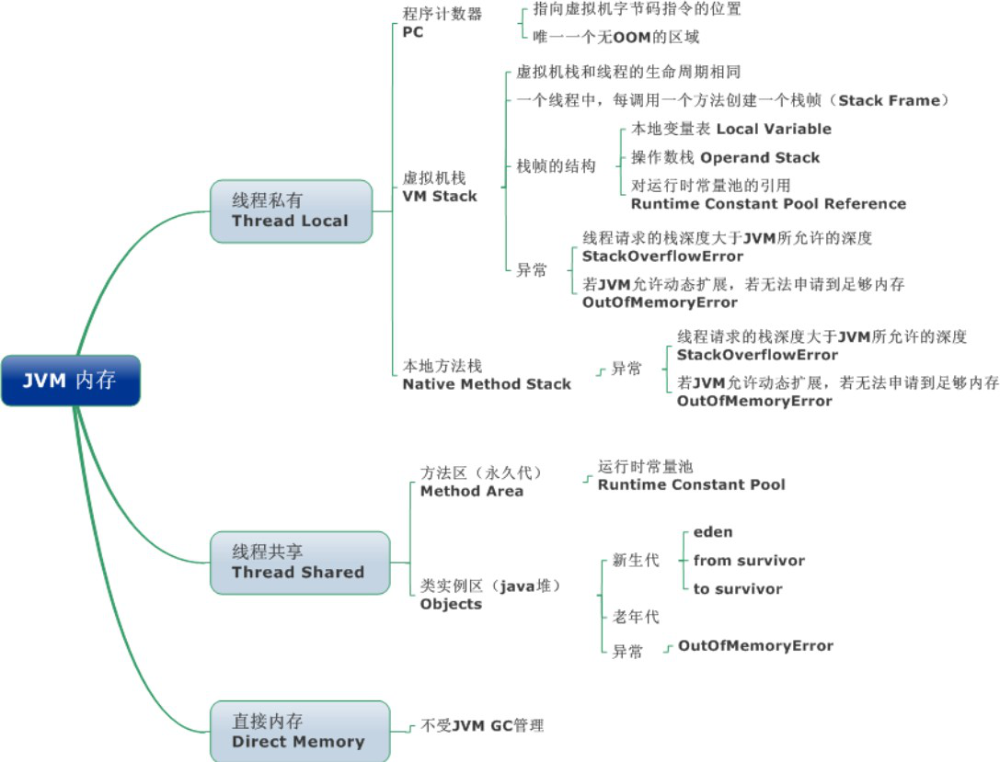
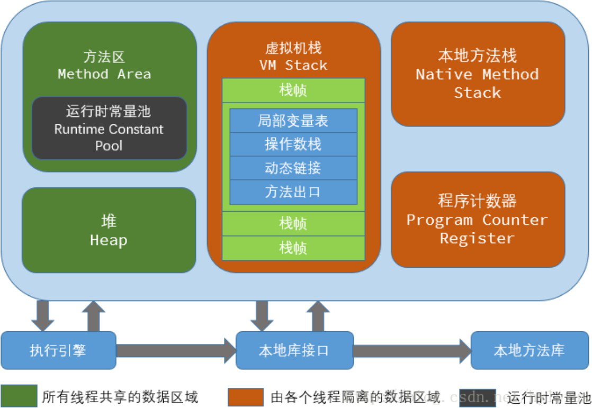
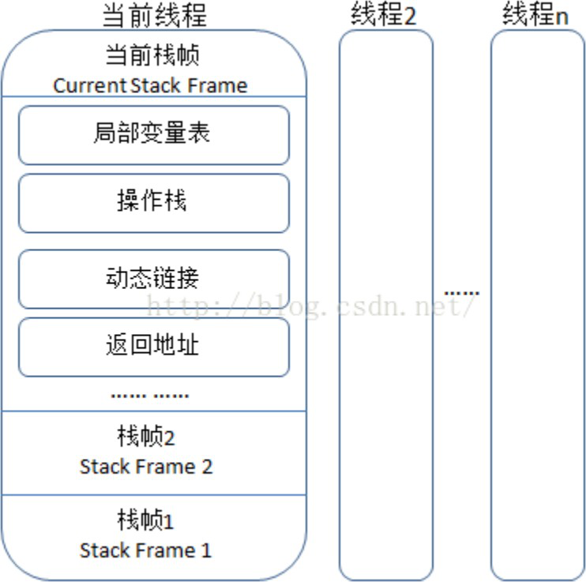

# JVM面试题


~~[说明：提供正版免费激活下载，以及激活工具和教程，点击获取](http://www.idejihuo.com)~~

[](http://www.idejihuo.com)


- [JVM面试题](#jvm面试题)
  - [目录](#目录)
    - [1、java中会存在内存泄漏吗，请简单描述。](#1java中会存在内存泄漏吗请简单描述)
    - [2、64 位 JVM 中，int 的长度是多数？](#264-位-jvm-中int-的长度是多数)
    - [3、Serial 与 Parallel GC 之间的不同之处？](#3serial-与-parallel-gc-之间的不同之处)
    - [4、32 位和 64 位的 JVM，int 类型变量的长度是多数？](#432-位和-64-位的-jvmint-类型变量的长度是多数)
    - [5、Java 中 WeakReference 与 SoftReference 的区别？](#5java-中-weakreference-与-softreference-的区别)
    - [6、JVM 选项 -XX:+UseCompressedOops 有什么作用？为什么要使用](#6jvm-选项--xxusecompressedoops-有什么作用为什么要使用)
    - [7、怎样通过 Java 程序来判断 JVM 是 32 位 还是 64位？](#7怎样通过-java-程序来判断-jvm-是-32-位-还是-64位)
    - [8、32 位 JVM 和 64 位 JVM 的最大堆内存分别是多数？](#832-位-jvm-和-64-位-jvm-的最大堆内存分别是多数)
    - [9、JRE、JDK、JVM 及 JIT 之间有什么不同？](#9jrejdkjvm-及-jit-之间有什么不同)
    - [10、解释 Java 堆空间及 GC？](#10解释-java-堆空间及-gc)
    - [11、JVM 内存区域](#11jvm-内存区域)
    - [12、程序计数器(线程私有)](#12程序计数器线程私有)
    - [13、虚拟机栈(线程私有)](#13虚拟机栈线程私有)
    - [14、本地方法区(线程私有)](#14本地方法区线程私有)
    - [15、你能保证 GC 执行吗？](#15你能保证-gc-执行吗)
    - [16、怎么获取 Java 程序使用的内存？堆使用的百分比？](#16怎么获取-java-程序使用的内存堆使用的百分比)
    - [17、Java  中堆和栈有什么区别？](#17java--中堆和栈有什么区别)
    - [18、描述一下 JVM 加载 class 文件的原理机制](#18描述一下-jvm-加载-class-文件的原理机制)
    - [19、GC 是什么？为什么要有 GC？](#19gc-是什么为什么要有-gc)
    - [20、堆（Heap-线程共享） -运行时数据区](#20堆heap-线程共享--运行时数据区)
    - [21、方法区/永久代（线程共享）](#21方法区永久代线程共享)
    - [22、JVM 运行时内存](#22jvm-运行时内存)
    - [23、新生代](#23新生代)
    - [24、老年代](#24老年代)
    - [25、永久代](#25永久代)
    - [26、JAVA8 与元数据](#26java8-与元数据)
    - [27、引用计数法](#27引用计数法)
    - [28、可达性分析](#28可达性分析)
    - [29、标记清除算法（ Mark-Sweep）](#29标记清除算法-mark-sweep)
    - [30、复制算法（copying）](#30复制算法copying)
    - [31、标记整理算法(Mark-Compact)](#31标记整理算法mark-compact)
    - [32、分代收集算法](#32分代收集算法)
    - [33、新生代与复制算法](#33新生代与复制算法)
    - [34、老年代与标记复制算法](#34老年代与标记复制算法)
    - [35、JAVA 强引用](#35java-强引用)
    - [36、JAVA软引用](#36java软引用)
    - [37、JAVA弱引用](#37java弱引用)
    - [38、JAVA虚引用](#38java虚引用)
    - [39、分代收集算法](#39分代收集算法)
    - [40、在新生代-复制算法](#40在新生代-复制算法)
    - [41、在老年代-标记整理算法](#41在老年代-标记整理算法)
    - [42、分区收集算法](#42分区收集算法)
    - [43、GC 垃圾收集器](#43gc-垃圾收集器)
    - [44、Serial 垃圾收集器（单线程、 复制算法）](#44serial-垃圾收集器单线程-复制算法)
    - [45、ParNew 垃圾收集器（Serial+多线程）](#45parnew-垃圾收集器serial多线程)
    - [46、Parallel Scavenge 收集器（多线程复制算法、高效）](#46parallel-scavenge-收集器多线程复制算法高效)
    - [57、Serial Old 收集器（单线程标记整理算法 ）](#57serial-old-收集器单线程标记整理算法-)
    - [58、Parallel Old 收集器（多线程标记整理算法）](#58parallel-old-收集器多线程标记整理算法)
    - [59、CMS 收集器（多线程标记清除算法）](#59cms-收集器多线程标记清除算法)
    - [60、G1 收集器](#60g1-收集器)
    - [61、JVM 类加载机制](#61jvm-类加载机制)
    - [62、类加载器](#62类加载器)
    - [63、双亲委派](#63双亲委派)
    - [64、OSGI（ 动态模型系统）](#64osgi-动态模型系统)
    - [65、动态改变构造](#65动态改变构造)
    - [66、模块化编程与热插拔](#66模块化编程与热插拔)
    - [67、JVM内存模型](#67jvm内存模型)
    - [68、栈](#68栈)
    - [69、本地方法栈](#69本地方法栈)
    - [70、程序计数器](#70程序计数器)
    - [71、堆](#71堆)
    - [72、方法区](#72方法区)
    - [73、分代回收](#73分代回收)
    - [74、堆和栈的区别](#74堆和栈的区别)
    - [75、什么时候会触发FullGC](#75什么时候会触发fullgc)
    - [76、什么是Java虚拟机？为什么Java被称作是“平台无关的编程语言”？](#76什么是java虚拟机为什么java被称作是平台无关的编程语言)
    - [78、描述一下JVM加载class文件的原理机制？](#78描述一下jvm加载class文件的原理机制)
    - [79、Java对象创建过程](#79java对象创建过程)
    - [80、简述Java的对象结构](#80简述java的对象结构)
    - [81、如何判断对象可以被回收](#81如何判断对象可以被回收)
    - [82、JVM的永久代中会发生垃圾回收么](#82jvm的永久代中会发生垃圾回收么)
    - [83、垃圾收集算法](#83垃圾收集算法)
    - [84、调优命令有哪些？](#84调优命令有哪些)
    - [85、调优工具](#85调优工具)
    - [86、Minor  GC与Full  GC分别在什么时候发生？](#86minor--gc与full--gc分别在什么时候发生)
    - [87、你知道哪些JVM性能调优](#87你知道哪些jvm性能调优)


---

## 目录


### 1、java中会存在内存泄漏吗，请简单描述。
会。自己实现堆载的数据结构时有可能会出现内存泄露，可参看effective java.


### 2、64 位 JVM 中，int 的长度是多数？
Java 中，int 类型变量的长度是一个固定值，与平台无关，都是 32 位。意思就是说，在 32 位 和 64 位 的 Java 虚拟机中，int 类型的长度是相同的。

### 3、Serial 与 Parallel GC 之间的不同之处？
Serial 与 Parallel 在 GC 执行的时候都会引起 stop-the-world。它们之间主要不同 serial 收集器是默认的复制收集器，执行 GC 的时候只有一个线程，而parallel 收集器使用多个 GC 线程来执行。


### 4、32 位和 64 位的 JVM，int 类型变量的长度是多数？
32 位和 64 位的 JVM 中，int 类型变量的长度是相同的，都是 32 位或者 4个字节。


### 5、Java 中 WeakReference 与 SoftReference 的区别？
虽然 WeakReference 与 SoftReference 都有利于提高 GC 和 内存的效率，但是 WeakReference ，一旦失去最后一个强引用，就会被 GC
回收，而软引用虽然不能阻止被回收，但是可以延迟到 JVM 内存不足的时候。


### 6、JVM 选项 -XX:+UseCompressedOops 有什么作用？为什么要使用
当你将你的应用从 32 位的 JVM 迁移到 64 位的 JVM 时，由于对象的指针从32 位增加到了 64 位，因此堆内存会突然增加，差不多要翻倍。这也会对 CPU缓存（容量比内存小很多）的数据产生不利的影响。因为，迁移到 64 位的 JVM主要动机在于可以指定最大堆大小，通过压缩OOP 可以节省一定的内存。通过-XX:+UseCompressedOops 选项，JVM 会使用 32 位的 OOP，而不是 64 位的 OOP。


### 7、怎样通过 Java 程序来判断 JVM 是 32 位 还是 64位？
你可以检查某些系统属性如 sun.arch.data.model 或 os.arch 来获取该信息。


### 8、32 位 JVM 和 64 位 JVM 的最大堆内存分别是多数？
理论上说上 32 位的 JVM 堆内存可以到达 2^32，即 4GB，但实际上会比这个小很多。不同操作系统之间不同，如 Windows 系统大约 1.5 GB，Solaris 大约3GB。64 位 JVM 允许指定最大的堆内存，理论上可以达到 2^64，这是一个非常大的数字，实际上你可以指定堆内存大小到 100GB。甚至有的 JVM，如 Azul，堆内存到 1000G 都是可能的。


### 9、JRE、JDK、JVM 及 JIT 之间有什么不同？
JRE 代表 Java 运行时（Java run-time），是运行 Java 引用所必须的。JDK 代表 Java 开发工具（Java development kit），是 Java 程序的开发工具，如 Java编译器，它也包含 JRE。JVM 代表 Java 虚拟机（Java virtual machine），它的责任是运行 Java 应用。JIT 代表即时编译
（Just In Time compilation），当代码执行的次数超过一定的阈值时，会将 Java 字节码转换为本地代码，如，主要的热点代码会被准换为本地代码，这样有利大幅度提高 Java 应用的性能。


### 10、解释 Java 堆空间及 GC？
当通过 Java 命令启动 Java 进程的时候，会为它分配内存。内存的一部分用于创建堆空间，当程序中创建对象的时候，就从对空间中分配内存。GC 是 JVM 内部的一个进程，回收无效对象的内存用于将来的分配。


### 11、JVM 内存区域

[](http://www.idejihuo.com)

JVM 内存区域主要分为线程私有区域【程序计数器、虚拟机栈、本地方法区】、线程共享区域【JAVA 堆、方法区】、直接内存。

线程私有数据区域生命周期与线程相同, 依赖用户线程的启动/结束 而 创建/销毁(在 Hotspot VM 内, 每个线程都与操作系统的本地线程直接映射, 因此这部分内存区域的存/否跟随本地线程的生/死对应)。

线程共享区域随虚拟机的启动/关闭而创建/销毁。

直接内存并不是 JVM 运行时数据区的一部分, 但也会被频繁的使用: 在 JDK 1.4 引入的 NIO 提供了基于 Channel 与 Buffer 的 IO 方式, 它可以使用 Native 函数库直接分配堆外内存, 然后使用DirectByteBuffer 对象作为这块内存的引用进行操作(详见: Java I/O 扩展), 这样就避免了在 Java堆和 Native 堆中来回复制数据, 因此在一些场景中可以显著提高性能。

[](http://www.idejihuo.com)


### 12、程序计数器(线程私有)

一块较小的内存空间, 是当前线程所执行的字节码的行号指示器，每条线程都要有一个独立的程序计数器，这类内存也称为“线程私有” 的内存。

正在执行 java 方法的话，计数器记录的是虚拟机字节码指令的地址（当前指令的地址） 。如果还是 Native 方法，则为空。这个内存区域是唯一一个在虚拟机中没有规定任何 OutOfMemoryError 情况的区域。


### 13、虚拟机栈(线程私有)

是描述java方法执行的内存模型，每个方法在执行的同时都会创建一个栈帧（Stack Frame）用于存储局部变量表、操作数栈、动态链接、方法出口等信息。 每一个方法从调用直至执行完成的过程，就对应着一个栈帧在虚拟机栈中入栈到出栈的过程。

栈帧（ Frame）是用来存储数据和部分过程结果的数据结构，同时也被用来处理动态链接(Dynamic Linking)、 方法返回值和异常分派（ Dispatch Exception）。 栈帧随着方法调用而创建，随着方法结束而销毁——无论方法是正常完成还是异常完成（抛出了在方法内未被捕获的异常）都算作方法结束。

[](http://www.idejihuo.com)


### 14、本地方法区(线程私有)
本地方法区和 Java Stack 作用类似, 区别是虚拟机栈为执行 Java 方法服务, 而本地方法栈则为Native 方法服务, 如果一个 VM 实现使用 C- linkage 模型来支持 Native 调用, 那么该栈将会是一个C 栈，但 HotSpot VM 直接就把本地方法栈和虚拟机栈合二为一 。


### 15、你能保证 GC 执行吗？
不能，虽然你可以调用 System.gc() 或者 Runtime.gc()，但是没有办法保证 GC的执行。


### 16、怎么获取 Java 程序使用的内存？堆使用的百分比？
可以通过 java.lang.Runtime 类中与内存相关方法来获取剩余的内存，总内存及最大堆内存。通过这些方法你也可以获取到堆使用的百分比及堆内存的剩余空间。Runtime.freeMemory() 方法返回剩余空间的字节数，Runtime.totalMemory()方法总内存的字节数， Runtime.maxMemory() 返回最大内存的字节数。


### 17、Java  中堆和栈有什么区别？
JVM中堆和栈属于不同的内存区域，使用目的也不同。栈常用于保存方法帧和局部变量，而对象总是在堆上分配。栈通常都比堆小，也不会在多个线程之间共享，而堆被整个 JVM 的所有线程共享。


### 18、描述一下 JVM 加载 class 文件的原理机制

JVM 中类的装载是由类加载器（ClassLoader）和它的子类来实现的，Java 中的类加载器是一个重要的 Java 运行时系统组件，它负责在运行时查找和装入类文件中的类。

由于 Java 的跨平台性，经过编译的 Java 源程序并不是一个可执行程序，而是一个或多个类文件。当 Java 程序需要使用某个类时，JVM 会确保这个类已经被加载、连接（验证、准备和解析）和初始化。类的加载是指把类的.class 文件中的数据读入到内存中，通常是创建一个字节数组读入.class 文件，然后产生与所加载类对应
的 Class 对象。

加载完成后，Class 对象还不完整，所以此时的类还不可用。当类被加载后就进入连接阶段，这一阶段包括验证、准备（为静态变量分配内存并设置默认的初始值）和解析（将符号引用替换为直接引用）三个步骤。最后 JVM 对
类进行初始化，包括：1)如果类存在直接的父类并且这个类还没有被初始化，那么就先初始化父类；2)如果类中存在初始化语句，就依次执行这些初始化语句。

类的加载是由类加载器完成的，类加载器包括：根加载器（BootStrap）、扩展加载器（Extension）、系统加载器（System）和用户自定义类加载器（java.lang.ClassLoader 的子类）。

从 Java 2（JDK 1.2）开始，类加载过程采取了父亲委托机制（PDM）。PDM 更好的保证了 Java 平台的安全性，在该机制中，JVM 自带的Bootstrap 是根加载器，其他的加载器都有且仅有一个父类加载器。类的加载首先请求父类加载器加载，父类加载器无能为力时才由其子类加载器自行加载。JVM 不会向 Java 程序提供对 Bootstrap 的引用。下面是关于几个类
加载器的说明：
1) Bootstrap：一般用本地代码实现，负责加载 JVM 基础核心类库（rt.jar）；
2) Extension：从 java.ext.dirs 系统属性所指定的目录中加载类库，它的父加载器是 Bootstrap；
3) System：又叫应用类加载器，其父类是 Extension。它是应用最广泛的类加载器。它从环境变量 classpath 或者系统属性```java.class.path```所指定的目录中记载类，是用户自定义加载器的默认父加载器。


### 19、GC 是什么？为什么要有 GC？

GC 是垃 圾收 集的 意思 ，内存 处理 是编 程人 员容 易出 现问 题的 地方 ，忘记 或者 错误的内 存回 收会 导致 程序 或系 统的 不稳 定甚 至崩 溃， Java 提供 的 GC 功能 可以 自动监测 对象 是否 超过 作用 域从 而达 到自 动回 收内 存的 目的 ，Java 语言 没有 提供 释放已分 配内存的 显示 操作 方法 。Java 程序 员不 用担 心内 存管 理， 因为 垃圾 收集 器会自动 进行 管理 。要 请求 垃圾 收集 ，可 以调 用下 面的 方法 之一 ：System.gc() 或Runtime.getRuntime().gc() ，但 JVM 可以 屏蔽 掉显 示的 垃圾 回收 调用 。

垃圾回收可以有效的防止内存泄露，有效的使用可以使用的内存。垃圾回收器通常是作为一个单独的低优先级的线程运行，不可预知的情况下对内存堆中已经死亡的或者长时间没有使用的对象进行清除和回收，程序员不能实时的调用垃圾回收器对某个对象或所有对象进行垃圾回收。在 Java 诞生初期，垃圾回收是 Java最大的亮点之一，因为服务器端的编程需要有效的防止内存泄露问题，然而时过境迁，如今 Java 的垃圾回收机制已经成为被诟病的东。移动智能终端用户通常觉得 iOS 的系统比 Android 系统有更好的用户体验，其中一个深层次的原因就在于 Android 系统中垃圾回收的不可预知性。


### 20、堆（Heap-线程共享） -运行时数据区

是被线程共享的一块内存区域， 创建的对象和数组都保存在 Java 堆内存中，也是垃圾收集器进行垃圾收集的最重要的内存区域。 由于现代VM 采用分代收集算法, 因此 Java 堆从 GC 的角度还可以细分为: 新生代(Eden 区、 From Survivor 区和 To Survivor 区)和老年代。

### 21、方法区/永久代（线程共享）
### 22、JVM 运行时内存
### 23、新生代
### 24、老年代
### 25、永久代
### 26、JAVA8 与元数据
### 27、引用计数法
### 28、可达性分析
### 29、标记清除算法（ Mark-Sweep）
### 30、复制算法（copying）
### 31、标记整理算法(Mark-Compact)
### 32、分代收集算法
### 33、新生代与复制算法
### 34、老年代与标记复制算法
### 35、JAVA 强引用
### 36、JAVA软引用
### 37、JAVA弱引用
### 38、JAVA虚引用
### 39、分代收集算法
### 40、在新生代-复制算法
### 41、在老年代-标记整理算法
### 42、分区收集算法
### 43、GC 垃圾收集器
### 44、Serial 垃圾收集器（单线程、 复制算法）
### 45、ParNew 垃圾收集器（Serial+多线程）
### 46、Parallel Scavenge 收集器（多线程复制算法、高效）
### 57、Serial Old 收集器（单线程标记整理算法 ）
### 58、Parallel Old 收集器（多线程标记整理算法）
### 59、CMS 收集器（多线程标记清除算法）
### 60、G1 收集器
### 61、JVM 类加载机制
### 62、类加载器
### 63、双亲委派
### 64、OSGI（ 动态模型系统）
### 65、动态改变构造
### 66、模块化编程与热插拔
### 67、JVM内存模型
### 68、栈
### 69、本地方法栈
### 70、程序计数器
### 71、堆
### 72、方法区
### 73、分代回收
### 74、堆和栈的区别
### 75、什么时候会触发FullGC
### 76、什么是Java虚拟机？为什么Java被称作是“平台无关的编程语言”？
### 78、描述一下JVM加载class文件的原理机制？
### 79、Java对象创建过程
### 80、简述Java的对象结构
### 81、如何判断对象可以被回收
### 82、JVM的永久代中会发生垃圾回收么
### 83、垃圾收集算法
### 84、调优命令有哪些？
### 85、调优工具
### 86、Minor  GC与Full  GC分别在什么时候发生？
### 87、你知道哪些JVM性能调优


