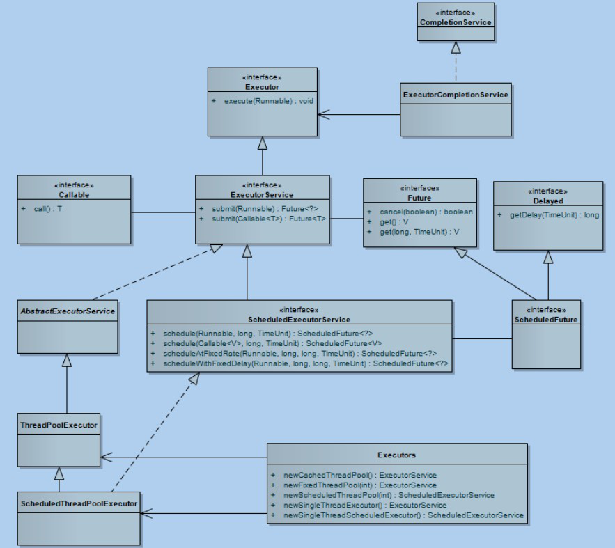

# Java 多线程/并发面试题


~~[说明：提供正版免费激活下载，以及激活工具和教程，点击获取](http://www.idejihuo.com)~~

[](http://www.idejihuo.com)


- [Java 多线程/并发面试题](#java-多线程并发面试题)
  - [目录](#目录)
    - [1、Java中实现多线程有几种方法](#1java中实现多线程有几种方法)
    - [2、继承 Thread 类](#2继承-thread-类)
    - [3、实现 Runnable 接口。](#3实现-runnable-接口)
    - [4、ExecutorService、 Callable、 Future 有返回值线程](#4executorservice-callable-future-有返回值线程)
    - [5、基于线程池的方式](#5基于线程池的方式)
    - [6、4 种线程池](#64-种线程池)
    - [7、如何停止一个正在运行的线程](#7如何停止一个正在运行的线程)
    - [8、notify()和notifyAll()有什么区别？](#8notify和notifyall有什么区别)
    - [9、sleep()和wait() 有什么区别？](#9sleep和wait-有什么区别)
    - [10、volatile 是什么?可以保证有序性吗?](#10volatile-是什么可以保证有序性吗)
    - [11、Thread 类中的start() 和 run() 方法有什么区别？](#11thread-类中的start-和-run-方法有什么区别)
    - [12、为什么wait, notify 和 notifyAll这些方法不在thread类里面？](#12为什么wait-notify-和-notifyall这些方法不在thread类里面)
    - [13、为什么wait和notify方法要在同步块中调用？](#13为什么wait和notify方法要在同步块中调用)
    - [14、Java中interrupted 和 isInterruptedd方法的区别？](#14java中interrupted-和-isinterruptedd方法的区别)
    - [15、Java中synchronized 和 ReentrantLock 有什么不同？](#15java中synchronized-和-reentrantlock-有什么不同)
    - [16、有三个线程T1,T2,T3,如何保证顺序执行？](#16有三个线程t1t2t3如何保证顺序执行)
    - [17、SynchronizedMap和ConcurrentHashMap有什么区别？](#17synchronizedmap和concurrenthashmap有什么区别)
    - [18、什么是线程安全](#18什么是线程安全)
    - [19、Thread类中的yield方法有什么作用？](#19thread类中的yield方法有什么作用)
    - [20、Java线程池中submit() 和 execute()方法有什么区别？](#20java线程池中submit-和-execute方法有什么区别)
    - [21、说一说自己对于 synchronized 关键字的了解](#21说一说自己对于-synchronized-关键字的了解)
    - [22、说说自己是怎么使用 synchronized  关键字，在项目中用到了吗synchronized关键字最主要的三种使用方式](#22说说自己是怎么使用-synchronized--关键字在项目中用到了吗synchronized关键字最主要的三种使用方式)
    - [23、什么是线程安全？Vector是一个线程安全类吗？](#23什么是线程安全vector是一个线程安全类吗)
    - [24、volatile关键字的作用？](#24volatile关键字的作用)
    - [25、简述一下你对线程池的理解](#25简述一下你对线程池的理解)
    - [26、线程生命周期(状态)](#26线程生命周期状态)
    - [27、新建状态（NEW）](#27新建状态new)
    - [28、就绪状态（RUNNABLE）](#28就绪状态runnable)
    - [29、运行状态（RUNNING）](#29运行状态running)
    - [30、阻塞状态（BLOCKED）](#30阻塞状态blocked)
    - [31、线程死亡（DEAD）](#31线程死亡dead)
    - [32、终止线程 4 种方式](#32终止线程-4-种方式)
    - [33、start 与 run 区别](#33start-与-run-区别)
    - [34、JAVA 后台线程](#34java-后台线程)
    - [35、什么是乐观锁](#35什么是乐观锁)
    - [36、什么是悲观锁](#36什么是悲观锁)
    - [37、什么是自旋锁](#37什么是自旋锁)
    - [38、Synchronized 同步锁](#38synchronized-同步锁)
    - [39、ReentrantLock](#39reentrantlock)
    - [40、Condition 类和 Object 类锁方法区别区别](#40condition-类和-object-类锁方法区别区别)
    - [41、tryLock 和 lock 和 lockInterruptibly 的区别](#41trylock-和-lock-和-lockinterruptibly-的区别)
    - [42、Semaphore 信号量](#42semaphore-信号量)
    - [43、Semaphore 与 ReentrantLock 区别](#43semaphore-与-reentrantlock-区别)
    - [44、可重入锁（递归锁）](#44可重入锁递归锁)
    - [45、公平锁与非公平锁](#45公平锁与非公平锁)
    - [46、ReadWriteLock 读写锁](#46readwritelock-读写锁)
    - [47、共享锁和独占锁](#47共享锁和独占锁)
    - [48、重量级锁（Mutex Lock）](#48重量级锁mutex-lock)
    - [49、轻量级锁](#49轻量级锁)
    - [50、偏向锁](#50偏向锁)
    - [51、分段锁](#51分段锁)
    - [52、锁优化](#52锁优化)
    - [53、线程基本方法](#53线程基本方法)
    - [54、线程等待（wait）](#54线程等待wait)
    - [55、线程睡眠（sleep）](#55线程睡眠sleep)
    - [56、线程让步（yield）](#56线程让步yield)
    - [57、线程中断（interrupt）](#57线程中断interrupt)
    - [58、Join 等待其他线程终止](#58join-等待其他线程终止)
    - [59、为什么要用 join()方法？](#59为什么要用-join方法)
    - [60、线程唤醒（notify）](#60线程唤醒notify)
    - [61、线程其他方法](#61线程其他方法)
    - [62、进程](#62进程)
    - [63、上下文](#63上下文)
    - [64、寄存器](#64寄存器)
    - [65、程序计数器](#65程序计数器)
    - [66、PCB-“切换桢”](#66pcb-切换桢)
    - [67、上下文切换的活动](#67上下文切换的活动)
    - [68、引起线程上下文切换的原因](#68引起线程上下文切换的原因)
    - [69、同步锁](#69同步锁)
    - [70、死锁](#70死锁)
    - [71、线程池原理](#71线程池原理)
    - [72、线程复](#72线程复)
    - [73、线程池的组成](#73线程池的组成)
    - [74、拒绝策略](#74拒绝策略)
    - [...](#)
    - [86、线程与进程的区别？](#86线程与进程的区别)
    - [87、什么是多线程中的上下文切换？](#87什么是多线程中的上下文切换)
    - [88、死锁与活锁的区别，死锁与饥饿的区别？](#88死锁与活锁的区别死锁与饥饿的区别)
    - [89、Java 中用到的线程调度算法是什么？](#89java-中用到的线程调度算法是什么)
    - [90、什么是线程组，为什么在 Java 中不推荐使用？](#90什么是线程组为什么在-java-中不推荐使用)
    - [91、为什么使用 Executor 框架？](#91为什么使用-executor-框架)
    - [92、在 Java 中 Executor 和 Executors 的区别？](#92在-java-中-executor-和-executors-的区别)
    - [93、如何在 Windows 和 Linux 上查找哪个线程使用的 CPU 时间最长？](#93如何在-windows-和-linux-上查找哪个线程使用的-cpu-时间最长)
    - [94、什么是原子操作？在 Java Concurrency API 中有哪些原子类(atomic classes)？](#94什么是原子操作在-java-concurrency-api-中有哪些原子类atomic-classes)
    - [95、Java Concurrency API 中的 Lock 接口(Lock interface)是什么？对比同步它有什么优势？](#95java-concurrency-api-中的-lock-接口lock-interface是什么对比同步它有什么优势)
    - [96、什么是 Executors 框架？](#96什么是-executors-框架)
    - [97、什么是阻塞队列？阻塞队列的实现原理是什么？如何使用阻塞队列来实现生产者-消费者  模型？](#97什么是阻塞队列阻塞队列的实现原理是什么如何使用阻塞队列来实现生产者-消费者--模型)
    - [98、什么是 Callable 和 Future?](#98什么是-callable-和-future)
    - [99、什么是 FutureTask?使用 ExecutorService 启动任务。](#99什么是-futuretask使用-executorservice-启动任务)
    - [100、什么是并发容器的实现？](#100什么是并发容器的实现)
    - [101、多线程同步和互斥有几种实现方法，都是什么？](#101多线程同步和互斥有几种实现方法都是什么)
    - [102、什么是竞争条件？你怎样发现和解决竞争？](#102什么是竞争条件你怎样发现和解决竞争)
    - [103、为什么我们调用 start()方法时会执行 run()方法，为什么我们不能直接调用 run()方法？](#103为什么我们调用-start方法时会执行-run方法为什么我们不能直接调用-run方法)
    - [104、Java 中你怎样唤醒一个阻塞的线程？](#104java-中你怎样唤醒一个阻塞的线程)
    - [105、在 Java 中 CycliBarriar 和 CountdownLatch 有什么区别？](#105在-java-中-cyclibarriar-和-countdownlatch-有什么区别)
    - [106、什么是不可变对象，它对写并发应用有什么帮助](#106什么是不可变对象它对写并发应用有什么帮助)
    - [107、Java 中用到的线程调度算法是什么？](#107java-中用到的线程调度算法是什么)
    - [108、什么是线程组，为什么在 Java 中不推荐使用？](#108什么是线程组为什么在-java-中不推荐使用)

---


## 目录

[](http://www.idejihuo.com)


### 1、Java中实现多线程有几种方法
- 继承Thread类；
- 实现Runnable接口；
- 实现Callable接口通过FutureTask包装器来创建Thread线程；
- 使用ExecutorService、Callable、Future实现有返回结果的多线程（也就是使用了ExecutorService来管理前面的三种方式）。


### 2、继承 Thread 类
Thread 类本质上是实现了 Runnable 接口的一个实例，代表一个线程的实例。 启动线程的唯一方法就是通过 Thread 类的 start()实例方法。 start()方法是一个 native 方法，它将启动一个新线
程，并执行 run()方法。
```
public class MyThread extends Thread { 
  public void run() {
    System.out.println("MyThread.run()");
  }
}
MyThread myThread1 = new MyThread(); 
myThread1.start();
```

### 3、实现 Runnable 接口。
如果自己的类已经 extends 另一个类，就无法直接 extends Thread，此时，可以实现一个Runnable 接口。
```
public class MyThread extends OtherClass implements Runnable { 
  public void run() {
    System.out.println("MyThread.run()");
  }
}
//启动 MyThread，需要首先实例化一个 Thread，并传入自己的 MyThread 实例：
MyThread myThread = new MyThread(); 
Thread thread = new Thread(myThread); 
thread.start();
//事实上，当传入一个 Runnable target 参数给 Thread 后， Thread 的 run()方法就会调用
target.run()  
public void run() {
  if (target != null) { 
    target.run();
  }
}
```

### 4、ExecutorService、 Callable、 Future 有返回值线程
有返回值的任务必须实现 Callable 接口，类似的，无返回值的任务必须 Runnable 接口。执行Callable 任务后，可以获取一个 Future 的对象，在该对象上调用 get 就可以获取到 Callable 任务返回的 Object 了，再结合线程池接口 ExecutorService 就可以实现传说中有返回结果的多线程了。
```
//创建一个线程池
ExecutorService pool = Executors.newFixedThreadPool(taskSize);
// 创建多个有返回值的任务
List<Future> list = new ArrayList<Future>(); 
for (int i = 0; i < taskSize; i++) {
  Callable c = new MyCallable(i + " ");
  // 执行任务并获取 Future 对象
  Future f = pool.submit(c); 
  list.add(f);
}
// 关闭线程池
pool.shutdown();
// 获取所有并发任务的运行结果
for (Future f : list) {
// 从 Future 对象上获取任务的返回值，并输出到控制台
System.out.println("res： " + f.get().toString());
}
```


### 5、基于线程池的方式
线程和数据库连接这些资源都是非常宝贵的资源。那么每次需要的时候创建，不需要的时候销毁，是非常浪费资源的。那么我们就可以使用缓存的策略，也就是使用线程池。
```
// 创建线程池
ExecutorService threadPool = Executors.newFixedThreadPool(10); 
while(true) {
  threadPool.execute(new Runnable() { // 提交多个线程任务，并执行
  @Override
  public void run() {
    System.out.println(Thread.currentThread().getName() + " is running .."); 
    try {
    Thread.sleep(3000);
  } catch (InterruptedException e) { 
    e.printStackTrace();
  }
}
});
}
}
```


### 6、4 种线程池

Java 里面线程池的顶级接口是 Executor，但是严格意义上讲 Executor 并不是一个线程池，而只是一个执行线程的工具。真正的线程池接口是 ExecutorService。

[](http://www.idejihuo.com)

***newCachedThreadPool***

创建一个可根据需要创建新线程的线程池，但是在以前构造的线程可用时将重用它们。对于执行很多短期异步任务的程序而言，这些线程池通常可提高程序性能。 调用 execute 将重用以前构造的线程（如果线程可用）。如果现有线程没有可用的，则创建一个新线程并添加到池中。终止并从缓存中移除那些已有 60 秒钟未被使用的线程。 因此，长时间保持空闲的线程池不会使用任何资源。

***newFixedThreadPool***

创建一个可重用固定线程数的线程池，以共享的无界队列方式来运行这些线程。在任意点，在大多数 nThreads 线程会处于处理任务的活动状态。如果在所有线程处于活动状态时提交附加任务， 则在有可用线程之前，附加任务将在队列中等待。如果在关闭前的执行期间由于失败而导致任何线程终止，那么一个新线程将代替它执行后续的任务（如果需要）。在某个线程被显式地关闭之前，池中的线程将一直存在。

***newScheduledThreadPool***

创建一个线程池，它可安排在给定延迟后运行命令或者定期地执行。
```
ScheduledExecutorService scheduledThreadPool= Executors.newScheduledThreadPool(3); scheduledThreadPool.schedule(newRunnable(){
@Override
public void run() { 
  System.out.println("延迟三秒");
}
}, 3, TimeUnit.SECONDS);
scheduledThreadPool.scheduleAtFixedRate(newRunnable(){ 
  @Override
  public void run() {
    System.out.println("延迟 1 秒后每三秒执行一次");
  }
},1,3,TimeUnit.SECONDS);
```


***newSingleThreadExecutor***

Executors.newSingleThreadExecutor()返回一个线程池（这个线程池只有一个线程） ,这个线程池可以在线程死后（或发生异常时）重新启动一个线程来替代原来的线程继续执行下去！


### 7、如何停止一个正在运行的线程

1) 1、使用退出标志，使线程正常退出，也就是当run方法完成后线程终止。
2) 2、使用stop方法强行终止，但是不推荐这个方法，因为stop和suspend及resume一样都是过期作废的方法。
3) 3、使用interrupt方法中断线程。
```
class MyThread extends Thread { 
  volatile boolean stop = false;
  public void run() { 
    while (!stop) {
  System.out.println(getName() + " is running"); 
    try {
    sleep(1000);
    } catch (InterruptedException e) { 
      System.out.println("week up from blcok..."); 
      stop = true; // 在异常处理代码中修改共享变量的状态
    }
  }
System.out.println(getName() + " is exiting...");
}
}

class InterruptThreadDemo3 {
public static void main(String[] args) throws InterruptedException { 
  MyThread m1 = new MyThread();
System.out.println("Starting thread..."); 
m1.start();
Thread.sleep(3000);
System.out.println("Interrupt thread...: " + m1.getName()); 
m1.stop = true; // 设置共享变量为true
m1.interrupt(); // 阻塞时退出阻塞状态
Thread.sleep(3000); // 主线程休眠3秒以便观察线程m1的中断情况
System.out.println("Stopping application...");
```


### 8、notify()和notifyAll()有什么区别？
- notify可能会导致死锁，而notifyAll则不会
任何时候只有一个线程可以获得锁，也就是说只有一个线程可以运行synchronized 中的代码使用notifyall,可以唤醒
- 所有处于wait状态的线程，使其重新进入锁的争夺队列中，而notify只能唤醒一个。
  wait() 应配合while循环使用，不应使用if，务必在wait()调用前后都检查条件，如果不满足，必须调用
- notify()唤醒另外的线程来处理，自己继续wait()直至条件满足再往下执行。
- notify()  是对notifyAll()的一个优化，但它有很精确的应用场景，并且要求正确使用。不然可能导致死锁。正确的场景应该是 WaitSet中等待的是相同的条件，唤醒任一个都能正确处理接下来的事项，如果唤醒的线程无法正确处理，务必确保继续notify()下一个线程，并且自身需要重新回到WaitSet中.


### 9、sleep()和wait() 有什么区别？
- 1.对于 sleep()方法，我们首先要知道该方法是属于 Thread 类中的。而 wait()方法，则是属于Object 类中的。
- 2.sleep()方法导致了程序暂停执行指定的时间，让出 cpu 该其他线程，但是他的监控状态依然保持者，当指定的时间到了又会自动恢复运行状态
- 3.在调用 sleep()方法的过程中， 线程不会释放对象锁。
- 4.而当调用 wait()方法的时候，线程会放弃对象锁，进入等待此对象的等待锁定池，只有针对此对象调用 notify()方法后本线程才进入对象锁定池准备获取对象锁进入运行状态。


### 10、volatile 是什么?可以保证有序性吗?
一旦一个共享变量（类的成员变量、类的静态成员变量）被volatile修饰之后，那么就具备了两层语义：
- 1）保证了不同线程对这个变量进行操作时的可见性，即一个线程修改了某个变量的值，这新值对其他线程来说是立即可见的,volatile关键字会强制将修改的值立即写入主存。
- 2）禁止进行指令重排序。volatile 不是原子性操作 什么叫保证部分有序性?
当程序执行到volatile变量的读操作或者写操作时，在其前面的操作的更改肯定全部已经进行，且结果已经对后面的操作可见；在其后面的操作肯定还没有进行；
```
x = 2;    // 语 句 1
y = 0; // 语 句 2 flag = true; //语句3 x = 4;    // 语 句 4
y = -1;   // 语 句 5
```

由于flag变量为volatile变量，那么在进行指令重排序的过程的时候，不会将语句3放到语句1、语句2前面，也不会讲语句3放到语句4、语句5后面。但是要注意语句1和语句2的顺序、语句4和语句5的顺序是不作任何保证的。

使用 Volatile 一般用于 状态标记量 和 单例模式的双检锁

### 11、Thread 类中的start() 和 run() 方法有什么区别？

### 12、为什么wait, notify 和 notifyAll这些方法不在thread类里面？

### 13、为什么wait和notify方法要在同步块中调用？

### 14、Java中interrupted 和 isInterruptedd方法的区别？

### 15、Java中synchronized 和 ReentrantLock 有什么不同？

### 16、有三个线程T1,T2,T3,如何保证顺序执行？

### 17、SynchronizedMap和ConcurrentHashMap有什么区别？

### 18、什么是线程安全

### 19、Thread类中的yield方法有什么作用？

### 20、Java线程池中submit() 和 execute()方法有什么区别？

### 21、说一说自己对于 synchronized 关键字的了解

### 22、说说自己是怎么使用 synchronized  关键字，在项目中用到了吗synchronized关键字最主要的三种使用方式

### 23、什么是线程安全？Vector是一个线程安全类吗？

### 24、volatile关键字的作用？

### 25、简述一下你对线程池的理解

### 26、线程生命周期(状态)

### 27、新建状态（NEW）

### 28、就绪状态（RUNNABLE）

### 29、运行状态（RUNNING）

### 30、阻塞状态（BLOCKED）

### 31、线程死亡（DEAD）

### 32、终止线程 4 种方式

### 33、start 与 run 区别

### 34、JAVA 后台线程

### 35、什么是乐观锁

### 36、什么是悲观锁

### 37、什么是自旋锁

### 38、Synchronized 同步锁

### 39、ReentrantLock

### 40、Condition 类和 Object 类锁方法区别区别

### 41、tryLock 和 lock 和 lockInterruptibly 的区别

### 42、Semaphore 信号量

### 43、Semaphore 与 ReentrantLock 区别

### 44、可重入锁（递归锁）

### 45、公平锁与非公平锁

### 46、ReadWriteLock 读写锁

### 47、共享锁和独占锁

### 48、重量级锁（Mutex Lock）

### 49、轻量级锁

### 50、偏向锁

### 51、分段锁

### 52、锁优化

### 53、线程基本方法

### 54、线程等待（wait）

### 55、线程睡眠（sleep）

### 56、线程让步（yield）

### 57、线程中断（interrupt）

### 58、Join 等待其他线程终止

### 59、为什么要用 join()方法？

### 60、线程唤醒（notify）

### 61、线程其他方法

### 62、进程

### 63、上下文

### 64、寄存器

### 65、程序计数器

### 66、PCB-“切换桢”

### 67、上下文切换的活动

### 68、引起线程上下文切换的原因

### 69、同步锁

### 70、死锁

### 71、线程池原理

### 72、线程复

### 73、线程池的组成

### 74、拒绝策略

### ...

### 86、线程与进程的区别？

### 87、什么是多线程中的上下文切换？

### 88、死锁与活锁的区别，死锁与饥饿的区别？

### 89、Java 中用到的线程调度算法是什么？

### 90、什么是线程组，为什么在 Java 中不推荐使用？

### 91、为什么使用 Executor 框架？

### 92、在 Java 中 Executor 和 Executors 的区别？

### 93、如何在 Windows 和 Linux 上查找哪个线程使用的 CPU 时间最长？

### 94、什么是原子操作？在 Java Concurrency API 中有哪些原子类(atomic classes)？

### 95、Java Concurrency API 中的 Lock 接口(Lock interface)是什么？对比同步它有什么优势？

### 96、什么是 Executors 框架？

### 97、什么是阻塞队列？阻塞队列的实现原理是什么？如何使用阻塞队列来实现生产者-消费者  模型？

### 98、什么是 Callable 和 Future?

### 99、什么是 FutureTask?使用 ExecutorService 启动任务。

### 100、什么是并发容器的实现？

### 101、多线程同步和互斥有几种实现方法，都是什么？

### 102、什么是竞争条件？你怎样发现和解决竞争？

### 103、为什么我们调用 start()方法时会执行 run()方法，为什么我们不能直接调用 run()方法？

### 104、Java 中你怎样唤醒一个阻塞的线程？

### 105、在 Java 中 CycliBarriar 和 CountdownLatch 有什么区别？

### 106、什么是不可变对象，它对写并发应用有什么帮助

### 107、Java 中用到的线程调度算法是什么？

### 108、什么是线程组，为什么在 Java 中不推荐使用？


