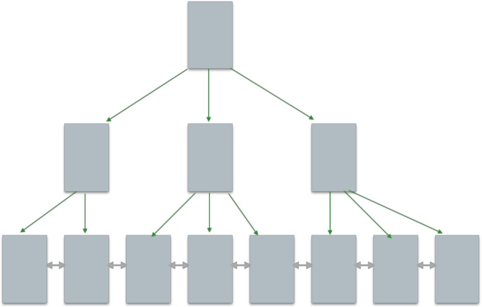
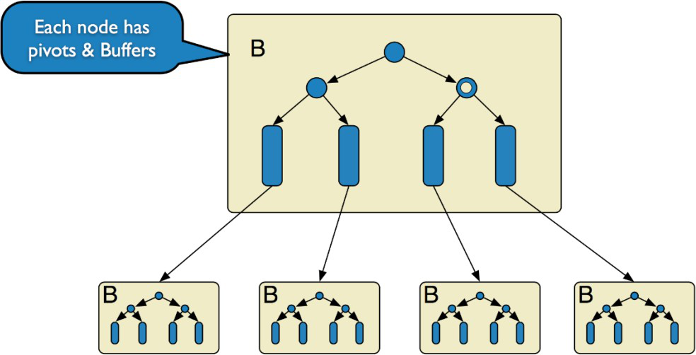
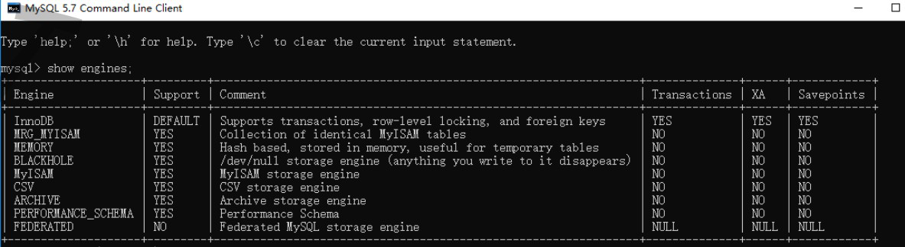
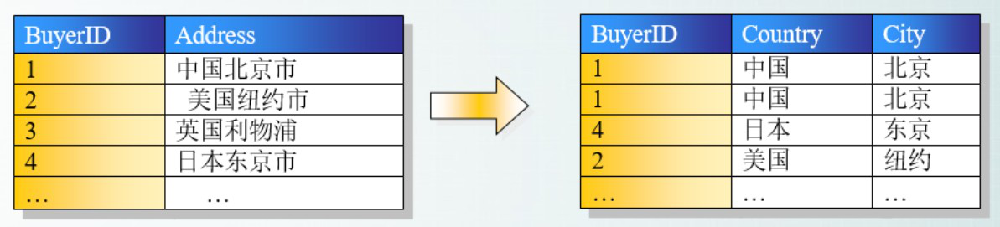
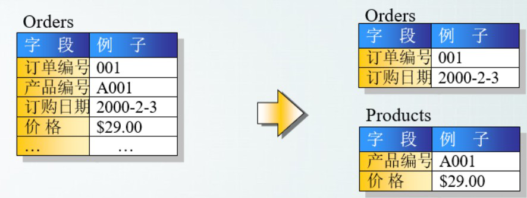
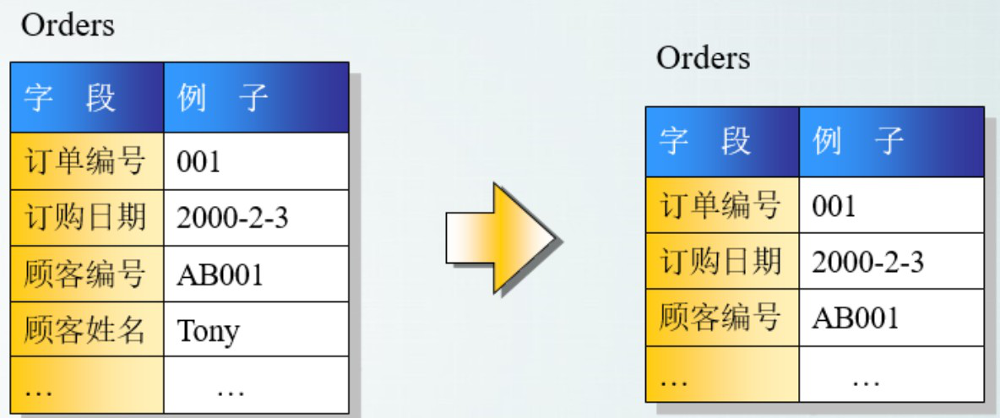
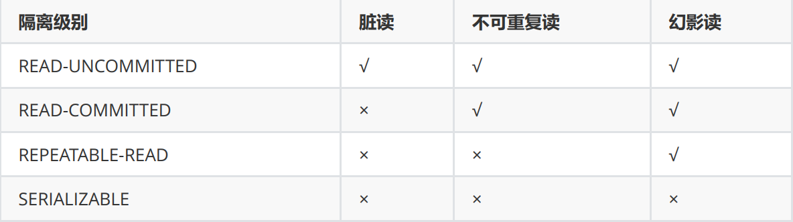

# MySQL面试题


~~[说明：提供正版免费激活下载，以及激活工具和教程，点击获取](http://www.idejihuo.com)~~

[](http://www.idejihuo.com)


- [MySQL面试题](#mysql面试题)
  - [目录](#目录)
    - [1、数据库存储引擎](#1数据库存储引擎)
    - [2、InnoDB（B+树）](#2innodbb树)
    - [3、TokuDB（ Fractal Tree-节点带数据）](#3tokudb-fractal-tree-节点带数据)
    - [4、MyIASM](#4myiasm)
    - [5、Memory](#5memory)
    - [6、数据库引擎有哪些](#6数据库引擎有哪些)
    - [7、InnoDB与MyISAM的区别](#7innodb与myisam的区别)
    - [8、索引](#8索引)
    - [9、常见索引原则有](#9常见索引原则有)
    - [10、数据库的三范式是什么](#10数据库的三范式是什么)
    - [11、第一范式(1st NF － 列都是不可再分)](#11第一范式1st-nf--列都是不可再分)
    - [12、第二范式(2nd NF－ 每个表只描述一件事情)](#12第二范式2nd-nf-每个表只描述一件事情)
    - [13、第三范式(3rd NF－ 不存在对非主键列的传递依赖)](#13第三范式3rd-nf-不存在对非主键列的传递依赖)
    - [14、数据库是事务](#14数据库是事务)
    - [15、SQL优化](#15sql优化)
    - [16、简单说一说drop、delete与truncate的区别](#16简单说一说dropdelete与truncate的区别)
    - [17、什么是视图](#17什么是视图)
    - [18、什么是内联接、左外联接、右外联接？](#18什么是内联接左外联接右外联接)
    - [19、并发事务带来哪些问题?](#19并发事务带来哪些问题)
    - [20、事务隔离级别有哪些?MySQL的默认隔离级别是?](#20事务隔离级别有哪些mysql的默认隔离级别是)
    - [21、水平分区](#21水平分区)
    - [22、分库分表之后,id 主键如何处理](#22分库分表之后id-主键如何处理)
    - [23、存储过程(特定功能的 SQL 语句集)](#23存储过程特定功能的-sql-语句集)
    - [24、存储过程优化思路](#24存储过程优化思路)
    - [25、触发器(一段能自动执行的程序)](#25触发器一段能自动执行的程序)
    - [26、数据库并发策略](#26数据库并发策略)
    - [27、MySQL 中有哪几种锁？](#27mysql-中有哪几种锁)
    - [28、MySQL 中有哪些不同的表格？](#28mysql-中有哪些不同的表格)
    - [29、简述在 MySQL 数据库中 MyISAM 和 InnoDB 的区别](#29简述在-mysql-数据库中-myisam-和-innodb-的区别)
    - [30、MySQL 中 InnoDB 支持的四种事务隔离级别名称，以及逐级之间的区别？](#30mysql-中-innodb-支持的四种事务隔离级别名称以及逐级之间的区别)
    - [31、CHAR 和 VARCHAR 的区别？](#31char-和-varchar-的区别)
    - [32、主键和候选键有什么区别？](#32主键和候选键有什么区别)
    - [33、myisamchk 是用来做什么的？](#33myisamchk-是用来做什么的)
    - [34、MyISAM Static 和 MyISAM Dynamic 有什么区别？](#34myisam-static-和-myisam-dynamic-有什么区别)
    - [35、如果一个表有一列定义为 TIMESTAMP，将发生什么？](#35如果一个表有一列定义为-timestamp将发生什么)
    - [36、你怎么看到为表格定义的所有索引？](#36你怎么看到为表格定义的所有索引)
    - [37、LIKE 声明中的％和_是什么意思？](#37like-声明中的和_是什么意思)
    - [38、列对比运算符是什么？](#38列对比运算符是什么)
    - [39、BLOB 和 TEXT 有什么区别？](#39blob-和-text-有什么区别)
    - [40、MySQL_fetch_array 和 MySQL_fetch_object 的区别是什么？](#40mysql_fetch_array-和-mysql_fetch_object-的区别是什么)
    - [41、MyISAM 表格将在哪里存储，并且还提供其存储格式？](#41myisam-表格将在哪里存储并且还提供其存储格式)
    - [42、MySQL 如何优化 DISTINCT？](#42mysql-如何优化-distinct)
    - [43、如何显示前 50 行？](#43如何显示前-50-行)
    - [44、可以使用多少列创建索引？](#44可以使用多少列创建索引)
    - [45、NOW（）和 CURRENT_DATE（）有什么区别？](#45now和-current_date有什么区别)
    - [46、什么是非标准字符串类型？](#46什么是非标准字符串类型)
    - [47、什么是通用 SQL 函数？](#47什么是通用-sql-函数)
    - [48、MySQL 支持事务吗？](#48mysql-支持事务吗)
    - [49、MySQL 里记录货币用什么字段类型好](#49mysql-里记录货币用什么字段类型好)
    - [50、MySQL 有关权限的表都有哪几个？](#50mysql-有关权限的表都有哪几个)
    - [更多...](#更多)


---

## 目录


### 1、数据库存储引擎
数据库存储引擎是数据库底层软件组织，数据库管理系统（DBMS）使用数据引擎进行创建、查询、更新和删除数据。不同的存储引擎提供不同的存储机制、索引技巧、锁定水平等功能，使用不同的存储引擎，还可以 获得特定的功能。现在许多不同的数据库管理系统都支持多种不同的数据引擎。存储引擎主要有： 
- 1. MyIsam , 
- 2. InnoDB, 
- 3. Memory, 
- 4. Archive, 
- 5. Federated 。


### 2、InnoDB（B+树）
InnoDB 底层存储结构为B+树， B树的每个节点对应innodb的一个page， page大小是固定的，一般设为 16k。其中非叶子节点只有键值， 叶子节点包含完成数据。

[](http://www.idejihuo.com)

适用场景：
1) 经常更新的表，适合处理多重并发的更新请求。
2) 支持事务。
3) 可以从灾难中恢复（通过 bin-log 日志等）。
4) 外键约束。只有他支持外键。        
5) 支持自动增加列属性 auto_increment。


### 3、TokuDB（ Fractal Tree-节点带数据）
TokuDB 底层存储结构为 Fractal Tree,Fractal Tree 的结构与 B+树有些类似, 在 Fractal Tree中， 每一个 child 指针除了需要指向一个 child 节点外，还会带有一个 Message Buffer ，这个Message Buffer 是一个 FIFO 的队列，用来缓存更新操作。

例如，一次插入操作只需要落在某节点的 Message Buffer 就可以马上返回了，并不需要搜索到叶子节点。这些缓存的更新会在查询时或后台异步合并应用到对应的节点中。

[](http://www.idejihuo.com)

TokuDB 在线添加索引，不影响读写操作, 非常快的写入性能， Fractal-tree 在事务实现上有优势。 他主要适用于访问频率不高的数据或历史数据归档。


### 4、MyIASM
MyIASM是  MySQL默认的引擎，但是它没有提供对数据库事务的支持，也不支持行级锁和外键，因此当  NSERT(插入)或   UPDATE(更新)数据时即写操作需要锁定整个表，效率便会低一些。

ISAM 执行读取操作的速度很快，而且不占用大量的内存和存储资源。在设计之初就预想数据组织成有固定长度的记录，按顺序存储的。
- ISAM 是一种静态索引结构。
- 缺点是它不 支持事务处理。


### 5、Memory
Memory（也叫 HEAP）堆内存：使用存在内存中的内容来创建表。每个 MEMORY 表只实际对应一个磁盘文件。 MEMORY 类型的表访问非常得快，因为它的数据是放在内存中的，并且默认使用HASH 索引。但是一旦服务关闭，表中的数据就会丢失掉。 Memory 同时支持散列索引和 B 树索引， B树索引可以使用部分查询和通配查询，也可以使用<,>和>=等操作符方便数据挖掘，散列索引相等的比较快但是对于范围的比较慢很多


### 6、数据库引擎有哪些
如何查看mysql提供的所有存储引擎
```
mysql> show engines;
```
[](http://www.idejihuo.com)

mysql常用引擎包括：```MYISAM```、```Innodb```、```Memory```、```MERGE```


1) **MYISAM**：全表锁，拥有较高的执行速度，不支持事务，不支持外键，并发性能差，占用空间相对较小，对事务完整性没有要求，以 select、insert为主的应用基本上可以使用这引擎
2) **Innodb**:行级锁，提供了具有提交、回滚和崩溃回复能力的事务安全，支持自动增长列，支持外键约束，并发能力强，占用空间是MYISAM的2.5倍，处理效率相对会差一些
3) **Memory**:全表锁，存储在内容中，速度快，但会占用和数据量成正比的内存空间且数据在mysql重启时会丢失，默认使用HASH索引， 检索效率非常高，但不适用于精确查找，主要用于那些内容变化不频繁的代码表
4) **MERGE**：是一组MYISAM表的组合


### 7、InnoDB与MyISAM的区别
1) InnoDB支持事务，MyISAM不支持，对于InnoDB每一条SQL语言都默认封装成事务，自动提交，这样会影响速度，所以最好把多条SQL语言放在begin和commit之间，组成一个事务；
2) InnoDB支持外键，而MyISAM不支持。对一个包含外键的InnoDB表转为MYISAM会失败；
3) InnoDB是聚集索引，数据文件是和索引绑在一起的，必须要有主键，通过主键索引效率很高。但是辅助索引需要两次查询，先查询到主键，然后再通过主键查询到数据。因此，主键不应该过大，因为主键太大，其他索引也都会很大。而MyISAM是非聚集索引，数据文件是分离的，索引保存的是数据文件的指针。主键索引和辅助索引是独立的。
4) InnoDB不保存表的具体行数，执行select count(*) from table时需要全表扫描。而MyISAM用一个变量保存了整个表的行数，执行上述语句时只需要读出该变量即可，速度很快；
5) Innodb不支持全文索引，而MyISAM支持全文索引，查询效率上MyISAM要高


### 8、索引
索引（Index）是帮助 MySQL 高效获取数据的数据结构。 常见的查询算法,顺序查找,二分查找,二叉排序树查找,哈希散列法,分块查找,平衡多路搜索树 B 树（B-tree） ，索引是对数据库表中一个或多个列的值进行排序的结构，建立索引有助于快速获取信息。

你也可以这样理解：索引就是加快检索表中数据的方法。数据库的索引类似于书籍的索引。在书籍中，索引允许用户不必翻阅完整个书就能迅速地找到所需要的信息。在数据库中，索引也允许数据库程序迅速地找到表中的数据，而不必扫描整个数据库

mysql 有4种不同的索引： 
- 主键索引（PRIMARY）
- 唯一索引（UNIQUE） 
- 普通索引（INDEX）
- 全文索引（FULLTEXT）

**索引并非是越多越好，创建索引也需要耗费资源，一是增加了数据库的存储空间，二是在插入和删除时要花费较多的时间维护索引**

- 索引加快数据库的检索速度
- 索引降低了插入、删除、修改等维护任务的速度唯一索引可以确保每一行数据的唯一性
- 通过使用索引，可以在查询的过程中使用优化隐藏器，提高系统的性能索引需要占物理和数据空间


### 9、常见索引原则有
1) 选择唯一性索引，唯一性索引的值是唯一的，可以更快速的通过该索引来确定某条记录。
2) 为经常需要排序、分组和联合操作的字段建立索引。
3) 为常用作为查询条件的字段建立索引。
4) 限制索引的数目：越多的索引，会使更新表变得很浪费时间。尽量使用数据量少的索引
5) 如果索引的值很长，那么查询的速度会受到影响。尽量使用前缀来索引
6) 如果索引字段的值很长，最好使用值的前缀来索引。
7) 删除不再使用或者很少使用的索引
8) 最左前缀匹配原则，非常重要的原则。
9) 尽量选择区分度高的列作为索引区分度的公式是表示字段不重复的比例
10) 索引列不能参与计算，保持列“干净”：带函数的查询不参与索引。
11) 尽量的扩展索引，不要新建索引


### 10、数据库的三范式是什么
- 第一范式：列不可再分
- 第二范式：行可以唯一区分，主键约束
- 第三范式：表的非主属性不能依赖与其他表的非主属性 外键约束

且三大范式是一级一级依赖的，第二范式建立在第一范式上，第三范式建立第一第二范式上 。


### 11、第一范式(1st NF － 列都是不可再分)
第一范式的目标是确保每列的原子性:如果每列都是不可再分的最小数据单元（也称为最小的原子单元），则满足第一范式（1NF）

[](http://www.idejihuo.com)


### 12、第二范式(2nd NF－ 每个表只描述一件事情)
首先满足第一范式，并且表中非主键列不存在对主键的部分依赖。 第二范式要求每个表只描述一件事情。

[](http://www.idejihuo.com)


### 13、第三范式(3rd NF－ 不存在对非主键列的传递依赖)
第三范式定义是，满足第二范式，并且表中的列不存在对非主键列的传递依赖。 除了主键订单编号外，顾客姓名依赖于非主键顾客编号。

[](http://www.idejihuo.com)


### 14、数据库是事务
事务(TRANSACTION)是作为单个逻辑工作单元执行的一系列操作，这些操作作为一个整体一起向系统提交，要么都执行、要么都不执行。事务是一个不可分割的工作逻辑单元事务必须具备以下四个属性，简称 ACID 属性：

**原子性（Atomicity）**

1) 事务是一个完整的操作。事务的各步操作是不可分的（原子的）；要么都执行，要么都不执行。
一致性（Consistency）
2) 当事务完成时，数据必须处于一致状态。
隔离性（Isolation）
3) 对数据进行修改的所有并发事务是彼此隔离的， 这表明事务必须是独立的，它不应以任何方式依赖于或影响其他事务。

**永久性（Durability）**
4) 事务完成后，它对数据库的修改被永久保持，事务日志能够保持事务的永久性


### 15、SQL优化
1) 查询语句中不要使用select *
2) 尽量减少子查询，使用关联查询（left join,right  join,inner  join）替代 
3) 减少使用IN或者NOT IN ,使用exists，not exists或者关联查询语句替代
4) or 的查询尽量用 union或者union all 代替(在确认没有重复数据或者不用剔除重复数据时，union all会更好) 
5) 应尽量避免在 where 子句中使用!=或<>操作符，否则将引擎放弃使用索引而进行全表扫描。
6) 应尽量避免在 where 子句中对字段进行 null 值判断，否则将导致引擎放弃使用索引而进行全表扫描，如： select id from t where num is null 可以在num上设置默认值0，确保表中num列没有null值，然后这样查询： select id from t where num=0


### 16、简单说一说drop、delete与truncate的区别
SQL中的drop、delete、truncate都表示删除，但是三者有一些差别delete和truncate只删除表的数据不删除表的结构
速度,一般来说: drop> truncate >delete
delete语句是dml,这个操作会放到rollback segement中,事务提交之后才生效;
如果有相应的trigger,执行的时候将被触发. truncate,drop是ddl, 操作立即生效,原数据不放到rollbacksegment中,不能回滚. 操作不触发
trigger


### 17、什么是视图
视图是一种虚拟的表，具有和物理表相同的功能。可以对视图进行增，改，查，操作，试图通常是有一个表或者多个表的行或列的子集。对视图的修改不影响基本表。它使得我们获取数据更容易，相比多表查询


### 18、什么是内联接、左外联接、右外联接？
- **内联接（Inner Join）**：匹配2张表中相关联的记录。
- **左外联接（Left Outer Join）**：除了匹配2张表中相关联的记录外，还会匹配左表中剩余的记录，右表中未匹配到的字段用NULL表示。
- **右外联接（Right Outer Join）**：除了匹配2张表中相关联的记录外，还会匹配右表中剩余的记录，左表中未匹配到的字段用NULL表示。在判定左表和右表时，要根据表名出现在Outer Join的左右位置关系


### 19、并发事务带来哪些问题?
在典型的应用程序中，多个事务并发运行，经常会操作相同的数据来完成各自的任务（多个用户对同一数据进行操作）。并发虽然是必须的，但可能会导致以下的问题。

- **脏读（Dirty read）**: 当一个事务正在访问数据并且对数据进行了修改，而这种修改还没有提交到数据库中，这时另外一个事务也访问了这个数据，然后使用了这个数据。因为这个数据是还没有提交的数据，那么另外一个事务读到的这个数据是“脏数据”，依据“脏数据”所做的操作可能是不正确的。

- **丢失修改（Lost to modify）**: 指在一个事务读取一个数据时，另外一个事务也访问了该数据，那么在第一个事务中修改了这个数据后，第二个事务也修改了这个数据。这样第一个事务内的修改结果就被丢失，因此称为丢失修。 例如：事务1读取某表中的数据A=20，事务2也读取A=20，事务1修改A=A-1，事务2也修改A=A-1，最终结果A=19，事务1的修改被丢失。

- **不可重复读（Unrepeatableread）**: 指在一个事务内多次读同一数据。在这个事务还没有结束时，另一个事务也访问该数据。那么，在第一个事务中的两次读数据之间，由于第二个事务的修改导致第一个事务两次读取的数据可能不太一样。这就发生了在一个事务内两次读到的数据是不一样的情况，因此称为不可重复读。

- **幻读（Phantom read）**: 幻读与不可重复读类似。它发生在一个事务（T1）读取了几行数据，接着另一个并发事务（T2）插入了一些数据时。在随后的查询中，第一个事务（T1）就会发现多了一些原本不存在的记录，就好像发生了幻觉一样，所以称为幻读。

- **不可重复读和幻读区别**：
不可重复读的重点是修改比如多次读取一条记录发现其中某些列的值被修改，幻读的重点在于新增或者删除比如多次读取一条记录发现记录增多或减少了


### 20、事务隔离级别有哪些?MySQL的默认隔离级别是?

SQL 标准定义了四个隔离级别：

- **READ-UNCOMMITTED(读取未提交)**： 最低的隔离级别，允许读取尚未提交的数据变更，可能会导致脏读、幻读或不可重复读。
- **READ-COMMITTED(读取已提交)**： 允许读取并发事务已经提交的数据，可以阻止脏读，但是幻读或不可重复读仍有可能发生。
- **REPEATABLE-READ(可重复读)**：     对同一字段的多次读取结果都是一致的，除非数据是被本身事务自己所修改，可以阻止脏读和不可重复读，但幻读仍有可能发生
- **SERIALIZABLE(可串行化)**：      最高的隔离级别，完全服从ACID的隔离级别。所有的事务依次逐个执行，这样事务之间就完全不可能产生干扰，也就是说，该级别可以防止脏读、不可重复读以及幻读


[](http://www.idejihuo.com)
MySQL InnoDB 存储引擎的默认支持的隔离级别是 REPEATABLE-READ（可重读）。我们可以通过SELECT @@tx_isolation; 命令来查看


```
mysql> SELECT @@tx_isolation;
+-----------------+
| @@tx_isolation |
+-----------------+
| REPEATABLE-READ |
+-----------------+
```

这里需要注意的是：与 SQL 标准不同的地方在于 InnoDB 存储引擎在 REPEATABLE-READ（可重读）事务隔离级别下使用的是Next-Key Lock 锁算法，因此可以避免幻读的产生，这与其他数据库系统(如SQL Server) 是不同的。所以说InnoDB 存储引擎的默认支持的隔离级别是REPEATABLE-READ（可重读） 已经可以完全保证事务的隔离性要求，即达到了 SQL标准的 SERIALIZABLE(可串行化) 隔离级别。因为隔离 级别越低，事务请求的锁越少，所以大部分数据库系统的隔离级别都是 READCOMMITTED(读取提交内容) ，但是你要知道的是InnoDB 存储引擎默认使用 REPEAaTABLEREAD（可重读） 并不会有任何性能损失

InnoDB 存储引擎在 分布式事务 的情况下一般会用到 SERIALIZABLE(可串行化) 隔离级别。

### 21、水平分区
### 22、分库分表之后,id 主键如何处理
### 23、存储过程(特定功能的 SQL 语句集)
### 24、存储过程优化思路
### 25、触发器(一段能自动执行的程序)
### 26、数据库并发策略
### 27、MySQL 中有哪几种锁？
### 28、MySQL 中有哪些不同的表格？
### 29、简述在 MySQL 数据库中 MyISAM 和 InnoDB 的区别
### 30、MySQL 中 InnoDB 支持的四种事务隔离级别名称，以及逐级之间的区别？
### 31、CHAR 和 VARCHAR 的区别？
### 32、主键和候选键有什么区别？
### 33、myisamchk 是用来做什么的？
### 34、MyISAM Static 和 MyISAM Dynamic 有什么区别？
### 35、如果一个表有一列定义为 TIMESTAMP，将发生什么？
### 36、你怎么看到为表格定义的所有索引？
### 37、LIKE 声明中的％和_是什么意思？
### 38、列对比运算符是什么？
### 39、BLOB 和 TEXT 有什么区别？
### 40、MySQL_fetch_array 和 MySQL_fetch_object 的区别是什么？
### 41、MyISAM 表格将在哪里存储，并且还提供其存储格式？
### 42、MySQL 如何优化 DISTINCT？
### 43、如何显示前 50 行？
### 44、可以使用多少列创建索引？
### 45、NOW（）和 CURRENT_DATE（）有什么区别？
### 46、什么是非标准字符串类型？
### 47、什么是通用 SQL 函数？
### 48、MySQL 支持事务吗？
### 49、MySQL 里记录货币用什么字段类型好
### 50、MySQL 有关权限的表都有哪几个？
### 更多...