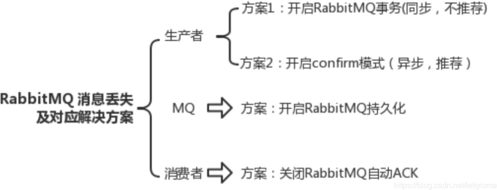
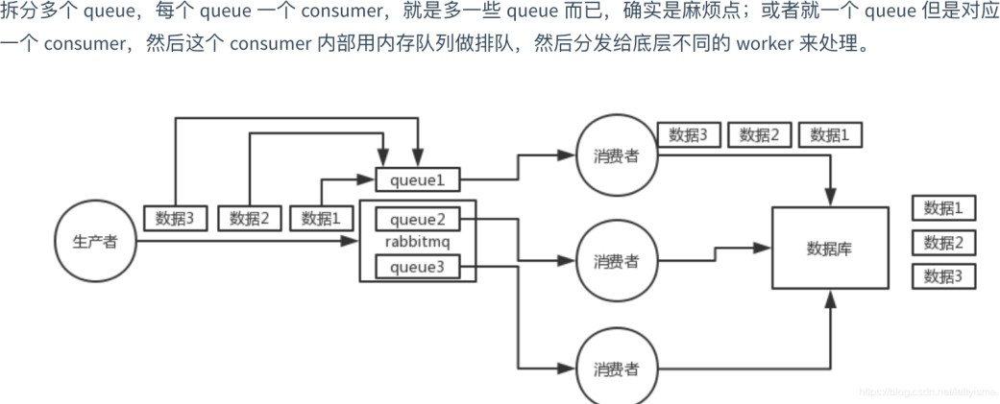
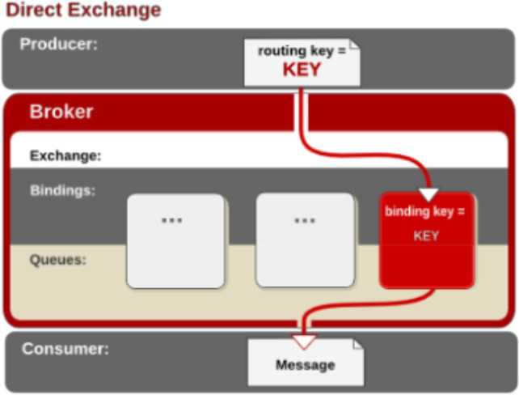
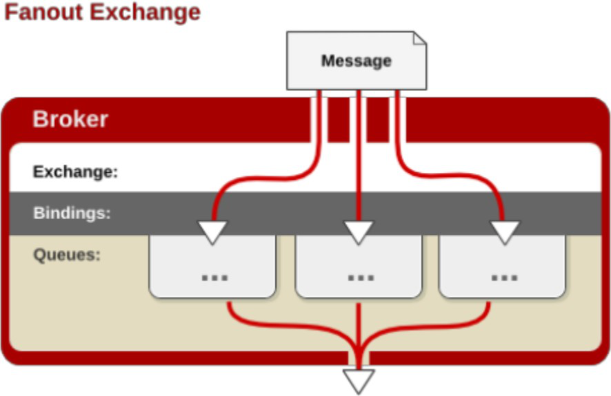
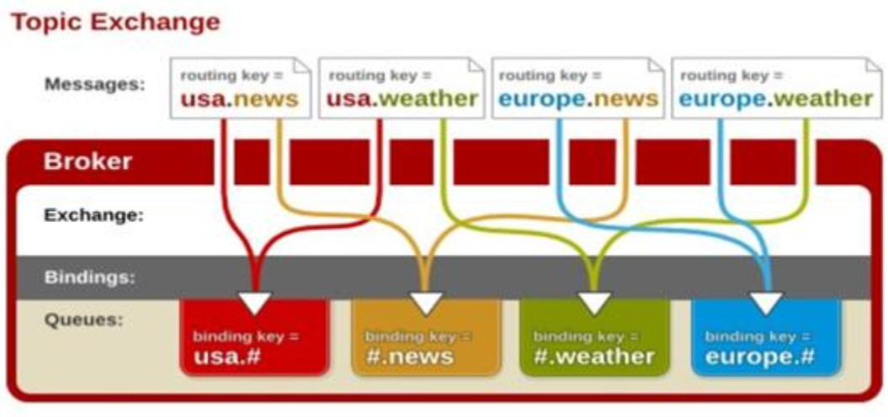

# RabbitMQ面试题

~~[说明：提供正版免费激活下载，以及激活工具和教程，点击获取](http://www.idejihuo.com)~~

- [RabbitMQ面试题](#rabbitmq面试题)
  - [目录](#目录)
    - [1、什么是 rabbitmq](#1什么是-rabbitmq)
    - [2、为什么要使用 rabbitmq](#2为什么要使用-rabbitmq)
    - [3、使用 rabbitmq 的场景](#3使用-rabbitmq-的场景)
    - [4、如何确保消息正确地发送至 RabbitMQ？ 如何确保消息接收方消费了消息？](#4如何确保消息正确地发送至-rabbitmq-如何确保消息接收方消费了消息)
    - [5、如何避免消息重复投递或重复消费？](#5如何避免消息重复投递或重复消费)
    - [6、消息基于什么传输？](#6消息基于什么传输)
    - [7、消息如何分发？](#7消息如何分发)
    - [8、消息怎么路由？](#8消息怎么路由)
    - [9、如何确保消息不丢失？](#9如何确保消息不丢失)
    - [10、使用 RabbitMQ 有什么好处？](#10使用-rabbitmq-有什么好处)
    - [11、RabbitMQ 的集群](#11rabbitmq-的集群)
    - [12、mq 的缺点](#12mq-的缺点)
    - [13、Kafka、ActiveMQ、RabbitMQ、RocketMQ 都有什么区别？](#13kafkaactivemqrabbitmqrocketmq-都有什么区别)
    - [14、如何保证高可用的？](#14如何保证高可用的)
    - [15、如何保证消息的可靠传输？如果消息丢了怎么办](#15如何保证消息的可靠传输如果消息丢了怎么办)
    - [16、如何保证消息的顺序性](#16如何保证消息的顺序性)
    - [17、如何解决消息队列的延时以及过期失效问题？消息队列满了以后该怎么处理？有几百万 消息持续积压几小时，说说怎么解决](#17如何解决消息队列的延时以及过期失效问题消息队列满了以后该怎么处理有几百万-消息持续积压几小时说说怎么解决)
    - [18、设计MQ的思路](#18设计mq的思路)
    - [19、什么是Message？](#19什么是message)
    - [20、什么是Publisher ？](#20什么是publisher-)
    - [21、什么是Exchange（将消息路由给队列 ）](#21什么是exchange将消息路由给队列-)
    - [22、什么是Binding（消息队列和交换器之间的关联）](#22什么是binding消息队列和交换器之间的关联)
    - [23、什么是Queue？](#23什么是queue)
    - [24、什么是Connection ？](#24什么是connection-)
    - [25、什么是Channel？](#25什么是channel)
    - [26、什么是Consumer ？](#26什么是consumer-)
    - [27、什么是Virtual Host ？](#27什么是virtual-host-)
    - [28、什么是Broker？](#28什么是broker)
    - [29、Exchange 类型 ？](#29exchange-类型-)
    - [30、Direct 键（routing key）分布 ？](#30direct-键routing-key分布-)
    - [31、Fanout（广播分发）？](#31fanout广播分发)
    - [32、topic 交换器（模式匹配） ？](#32topic-交换器模式匹配-)
    - [更多...](#更多)

---

## 目录

### 1、什么是 rabbitmq
采用 AMQP 高级消息队列协议的一种消息队列技术,最大的特点就是消费并不需要确保提供方存在,实现了服务之间的高度解耦

### 2、为什么要使用 rabbitmq
1) 在分布式系统下具备异步,削峰,负载均衡等一系列高级功能;
2) 拥有持久化的机制，进程消息，队列中的信息也可以保存下来。
3) 实现消费者和生产者之间的解耦。
4) 对于高并发场景下，利用消息队列可以使得同步访问变为串行访问达到一定量的限流，利于数据库的操作。
5) 可以使用消息队列达到异步下单的效果，排队中，后台进行逻辑下单。

### 3、使用 rabbitmq 的场景
1) 服务间异步通信
2) 顺序消费
3) 定时任务
4) 请求削峰

### 4、如何确保消息正确地发送至 RabbitMQ？ 如何确保消息接收方消费了消息？

**发送方确认模式**

将信道设置成 confirm 模式（发送方确认模式），则所有在信道上发布的消息都会被指派一个唯一的 ID。

一旦消息被投递到目的队列后，或者消息被写入磁盘后（可持久化的消息），信道会发送一个确认给生产者（包含消息唯一 ID）。

如果 RabbitMQ 发生内部错误从而导致消息丢失，会发送一条 nack（notacknowledged，未确认）消息。发送方确认模式是异步的，生产者应用程序在等待确认的同时，可以继续发送消息。当确认消息到达生产者应用程序，生产者应用程序的回调方法就会被触发来处理确认消息。

**接收方确认机制**

接收方消息确认机制

消费者接收每一条消息后都必须进行确认（消息接收和消息确认是两个不同操作）。只有消费者确认了消息，RabbitMQ 才能安全地把消息从队列中删除。这里并没有用到超时机制，RabbitMQ 仅通过 Consumer 的连接中断来确认是否需要重新发送消息。也就是说，只要连接不中断，RabbitMQ 给了 Consumer 足够长的时间来处理消息。保证数据的最终一致性；

下面罗列几种特殊情况

如果消费者接收到消息，在确认之前断开了连接或取消订阅，RabbitMQ 会认为消息没有被分发，然后重新分发给下一个订阅的消费者。

（可能存在消息重复消费的隐患，需要去重）如果消费者接收到消息却没有确认消息，连接也未断开，则 RabbitMQ 认为该消费者繁忙，将不会给该消费者分发更多的消息。

### 5、如何避免消息重复投递或重复消费？

在消息生产时，MQ 内部针对每条生产者发送的消息生成一个 inner-msg-id，作为去重的依据（消息投递失败并重传），避免重复的消息进入队列；

在消息消费时，要求消息体中必须要有一个 bizId（对于同一业务全局唯一，如支付 ID、订单 ID、帖子 ID 等）作为去重的依据，避免同一条消息被重复消费。

### 6、消息基于什么传输？
由于 TCP 连接的创建和销毁开销较大，且并发数受系统资源限制，会造成性能瓶颈。RabbitMQ 使用信道的方式来传输数据。信道是建立在真实的 TCP 连接内的虚拟连接，且每条 TCP 连接上的信道数量没有限制

### 7、消息如何分发？
若该队列至少有一个消费者订阅，消息将以循环（round-robin）的方式发送给消费者。每条消息只会分发给一个订阅的消费者（前提是消费者能够正常处理消息并进行确认）。
通过路由可实现多消费的功能

### 8、消息怎么路由？
消息提供方->路由->一至多个队列

消息发布到交换器时，消息将拥有一个路由键（routing key），在消息创建时设定。

通过队列路由键，可以把队列绑定到交换器上。

消息到达交换器后，RabbitMQ 会将消息的路由键与队列的路由键进行匹配（针对不同的交换器有不同的路由规则）；

***常用的交换器主要分为一下三种***

- fanout：如果交换器收到消息，将会广播到所有绑定的队列上
- direct：如果路由键完全匹配，消息就被投递到相应的队列
- topic：可以使来自不同源头的消息能够到达同一个队列。 使用topic 交换器时，可以使用通配符

### 9、如何确保消息不丢失？

消息持久化，当然前提是队列必须持久化

RabbitMQ 确保持久性消息能从服务器重启中恢复的方式是，将它们写入磁盘上的一个持久化日志文件，当发布一条持久性消息到持久交换器上时，Rabbit 会在消息提交到日志文件后才发送响应。

一旦消费者从持久队列中消费了一条持久化消息，RabbitMQ 会在持久化日志中把这条消息标记为等待垃圾收集。如果持久化消息在被消费之前 RabbitMQ 重启，那么 Rabbit 会自动重建交换器和队列（以及绑定），并重新发布持久化日志文件中的消息到合适的队列。

### 10、使用 RabbitMQ 有什么好处？
- 1、服务间高度解耦
- 2、异步通信性能高
- 3、流量削峰

### 11、RabbitMQ 的集群

**镜像集群模式**

你创建的 queue，无论元数据还是 queue 里的消息都会存在于多个实例上，然后每次你写消息到 queue 的时候，都会自动把消息到多个实例的 queue 里进行消息同步。

好处在于，你任何一个机器宕机了，没事儿，别的机器都可以用。坏处在于，第一，这个性能开销也太大了吧，消息同步所有机器，导致网络带宽压力和消耗很重！第二，这么玩儿，就没有扩展性可言了，如果某个 queue 负载很重，你加机器，新增的机器也包含了这个 queue 的所有数据，并没有办法线性扩展你的 queue。

### 12、mq 的缺点

- **系统可用性降低**

系统引入的外部依赖越多，越容易挂掉，本来你就是 A 系统调用 BCD 三个系统的接口就好了，人 ABCD 四个系统好好的，没啥问题，你偏加个 MQ 进来，万一MQ 挂了咋整？MQ 挂了，整套系统崩溃了，你不就完了么。

- **系统复杂性提高**

硬生生加个 MQ 进来，你怎么保证消息没有重复消费？怎么处理消息丢失的情况？怎么保证消息传递的顺序性？头大头大，问题一大堆，痛苦不已

- **一致性问题**

A 系统处理完了直接返回成功了，人都以为你这个请求就成功了；但是问题是，要是 BCD 三个系统那里，BD 两个系统写库成功了，结果 C 系统写库失败了，咋整？你这数据就不一致了。

所以消息队列实际是一种非常复杂的架构，你引入它有很多好处，但是也得针对它带来的坏处做各种额外的技术方案和架构来规避掉，最好之后，你会发现，妈呀，系统复杂度提升了一个数量级，也许是复杂了 10 倍。但是关键时刻，用，还是得用的

### 13、Kafka、ActiveMQ、RabbitMQ、RocketMQ 都有什么区别？

对于吞吐量来说kafka和RocketMQ支撑高吞吐，ActiveMQ和RabbitMQ比他们低一个数量级。对于延迟量来说RabbitMQ是最低的。

- 1.从社区活跃度

按照目前网络上的资料，RabbitMQ 、activeM 、ZeroMQ 三者中，综合来看，RabbitMQ 是首选。

- 2.持久化消息比较

ActiveMq 和RabbitMq 都支持。持久化消息主要是指我们机器在不可抗力因素等情况下挂掉了，消息不会丢失的机制。

- 3.综合技术实现

可靠性、灵活的路由、集群、事务、高可用的队列、消息排序、问题追踪、可视化管理工具、插件系统等等。
RabbitMq / Kafka 最好，ActiveMq 次之，ZeroMq 最差。当然ZeroMq 也可以做到，不过自己必须手动写代码实现，代码量不小。尤其是可靠性中的：持久性、投递确认、发布者证实和高可用性。

- 4.高并发

毋庸置疑，RabbitMQ 最高，原因是它的实现语言是天生具备高并发高可用的erlang 语言。

- 5.比较关注的比较， RabbitMQ 和 Kafka

RabbitMq 比Kafka 成熟，在可用性上，稳定性上，可靠性上， RabbitMq 胜于 Kafka （理论上）。另外，Kafka 的定位主要在日志等方面， 因为Kafka 设计的初衷就是处理日志的，可以看做是一个日志（消息）系统一个重要组件，针对性很强，所以 如果业务方面还是建议选择 RabbitMq 。还有就是，Kafka 的性能（吞吐量、TPS ）比RabbitMq 要高出来很多

### 14、如何保证高可用的？

RabbitMQ 是比较有代表性的，因为是基于主从（非分布式）做高可用性的，我们就以 RabbitMQ 为例子讲解第一种 MQ 的高可用性怎么实现。RabbitMQ 有三种模式：***单机模式***、***普通集群模式***、***镜像集群模式***。

单机模式，就是 Demo 级别的，一般就是你本地启动了玩玩儿的?，没人生产用单机模式普通集群模式，意思就是在多台机器上启动多个RabbitMQ 实例，每个机器启动一个。你创建的queue，只会放在一个 RabbitMQ 实例上，但是每个实例都同步 queue 的元数据（元数据可以认为是queue 的一些配置信息，通过元数据，可以找到 queue 所在实例）。你消费的时候，实际上如果连接到了另外一个实例，那么那个实例会从 queue 所在实例上拉取数据过来。这方案主要是提高吞吐量的，就是说让集群中多个节点来服务某个 queue 的读写操作。

镜像集群模式：这种模式，才是所谓的 RabbitMQ 的高可用模式。跟普通集群模式不一样的是，在镜像集群模式下，你创建的 queue，无论元数据还是 queue 里的消息都会存在于多个实例上，就是说，每个 RabbitMQ 节点都有这个 queue 的一个完整镜像，包含 queue 的全部数据的意思。然后每次你写消息到 queue 的时候，都会自动把消息同步到多个实例的 queue 上。RabbitMQ 有很好的管理控制台，就是在后台新增一个策略，这个策略是镜像集群模式的策略，指定的时候是可以要求数据同步到所有节点的，也可以要求同步到指定数量的节点，再次创建 queue 的时候，应用这个策略，就会自动将数据同步到其他的节点上去了。这样的话，好处在于，你任何一个机器宕机了， 没事儿，其它机器（节点）还包含了这个 queue 的完整数据，别的 consumer 都可以到其它节点上去消费数据。坏处在于，第一，这个性能开销也太大了吧，消息需要同步到所有机器上，导致网络带宽压力和消耗很重！RabbitMQ 一个 queue 的数据都是放在一个节点里的， 镜像集群下，也是每个节点都放这个 queue 的完整数据

Kafka 一个最基本的架构认识：由多个 broker 组成，每个 broker 是一个节点；你创建一个 topic，这个 topic 可以划分为多个 partition， 每个 partition 可以存在于不同的 broker 上，每个 partition 就放一部分数据。这就是天然的分布式消息队列，就是说一个 topic 的数据， 是分散放在多个机器上的，每个机器就放一部分数据。Kafka 0.8 以后，提供了 HA 机制，就是 replica（复制品） 副本机制。每个partition 的数据都会同步到其它机器上，形成自己的多个 replica 副本。所有 replica 会选举一个leader 出来，那么生产和消费都跟这个 leader 打交道，然后其他 replica 就是 follower。写的时候，leader 会负责把数据同步到所有 follower 上去，读的时候就直接读 leader 上的数据即可。只能读写leader？很简单，要是你可以随意读写每个 follower，那么就要 care 数据一致性的问题，系统复杂度太高，很容易出问题。Kafka 会均匀地将一个 partition 的所有 replica 分布在不同的机器上，这样才可以提高容错性。因为如果某个 broker 宕机了，没事儿，那个 broker上面的 partition 在其他机器上都有副本的，如果这上面有某个 partition 的 leader，那么此时会从 follower 中重新选举一个新的 leader出来，大家继续读写那个新的leader 即可。这就有所谓的高可用性了。写数据的时候，生产者就写leader，然后 leader 将数据落地写本地磁盘，接着其他 follower 自己主动从 leader 来 pull 数据。一旦所有 follower 同步好数据了，就会发送 ack 给 leader，leader 收到所有 follower 的 ack 之后，就会返回写成功的消息给生产者。（当然，这只是其中一种模式，还可以适当调整这个行为）消费的时候，只会从 leader 去读，但是只有当一个消息已经被所有 follower 都同步成功返回 ack 的时候，这个消息才会被消费者读到

### 15、如何保证消息的可靠传输？如果消息丢了怎么办

数据的丢失问题，可能出现在生产者、MQ、消费者中

- **生产者丢失**：生产者将数据发送到 RabbitMQ 的时候，可能数据就在半路给搞丢了，因为网络问题啥的，都有可能。此时可以选择用RabbitMQ 提供的事务功能，就是生产者发送数据之前开启 RabbitMQ事务channel.txSelect，然后发送消息，如果消息没有成功被RabbitMQ 接收到，那么生产者会收到异常报错，此时就可以回滚事务channel.txRollback，然后重试发送消息；如果收到了消息，那么可以提交事务channel.txCommit。吞吐量会下来，因为太耗性能。所以一般来说，如果你要确保说写RabbitMQ 的消息别丢，可以开启confirm模式，在生产者那里设置开启confirm模式之后，你每次写的消息都会分配一个唯一的 id，然后如果写入了 RabbitMQ 中， RabbitMQ 会给你回传一个ack消息，告诉你说这个消息 ok 了。如果 RabbitMQ 没能处理这个消息，会回调你一个nack接口，告诉你这个消息接收失败，你可以重试。而且你可以结合这个机制自己在内存里维护每个消息 id 的状态，如果超过一定时间还没接收到这个消息的回调，那么你可以重发。事务机制和cnofirm机制最大的不同在于，事务机制是同步的，你提交一个事务之后会阻塞在那儿，但是confirm机  制是异步的，你发送个消息之后就可以发送下一个消息，然后那个消息RabbitMQ 接收了之后会异步回调你一个接口通知你这个消息接收到了。所以一般在生产者这块避免数据丢失，都是用confirm机制的

- **MQ中丢失**：就是 RabbitMQ 自己弄丢了数据，这个你必须开启 RabbitMQ 的持久化，就是消息写入之后会持久化到磁盘，哪怕是RabbitMQ 自己挂了，恢复之后会自动读取之前存储的数据，一般数据不会丢。设置持久化有两个步骤：创建 queue 的时候将其设置为持久化，这样就可以保证 RabbitMQ 持久化 queue 的元数据，但是不会持久化 queue 里的数据。第二个是发送消息的时候将消息的deliveryMode 设置为 2，就是将消息设置为持久化的，此时 RabbitMQ 就会将消息持久化到磁盘上去。必须要同时设置这两个持久化才行，RabbitMQ 哪怕是挂了，再次重启，也会从磁盘上重启恢复queue，恢复这个 queue 里的数据。持久化可以跟生产者那边的confirm机制配合起来，只有消息被持久化到磁盘之后，才会通知生产者ack了，所以哪怕是在持久化到磁盘之前，RabbitMQ 挂了，数据丢了，生产者收不到ack，你也是可以自己重发的。注意，哪怕是你给 RabbitMQ 开启了持久化机制，也有一种可能，就是这个消息写到了 RabbitMQ 中，但是还没来得及持久化到磁盘上，结果不巧，此时RabbitMQ 挂了，就会导致内存里的一点点数据丢失

- **消费端丢失**：你消费的时候，刚消费到，还没处理，结果进程挂了，比如重启了，那么就尴尬了，RabbitMQ 认为你都消费了，这数据就丢了。这个时候得用 RabbitMQ 提供的ack机制，简单来说，就是你关闭 RabbitMQ 的自动ack，可以通过一个 api 来调用就行，然后每次你自己代码里确保处理完的时候，再在程序里ack一把。这样的话，如果你还没处理完，不就没有ack？那 RabbitMQ 就认为你还没处理完， 这个时候 RabbitMQ 会把这个消费分配给别的 consumer 去处理，消息是不会丢的

### 16、如何保证消息的顺序性
先看看顺序会错乱的场景：RabbitMQ：一个 queue，多个 consumer，这不明显乱了；

**解决：**

### 17、如何解决消息队列的延时以及过期失效问题？消息队列满了以后该怎么处理？有几百万 消息持续积压几小时，说说怎么解决

消息积压处理办法：临时紧急扩容：

先修复 consumer 的问题，确保其恢复消费速度，然后将现有 cnosumer 都停掉。新建一个 topic，partition 是原来的 10 倍，临时建立好原先 10 倍的 queue 数量。然后写一个临时的分发数据的 consumer 程序，这个程序部署上去消费积压的数据，消费之后不做耗时的处理，直接均匀轮询写入临时建立好的 10 倍数量的 queue。

接着临时征用 10 倍的机器来部署 consumer，每一批 consumer 消费一个临时 queue 的数据。这种做法相当于是临时将 queue 资源和consumer 资源扩大 10 倍，以正常的 10 倍速度来消费数据。等快速消费完积压数据之后，得恢复原先部署的架构，重新用原先的consumer 机器来消费消息。MQ中消息失效：假设你用的是 RabbitMQ，RabbtiMQ 是可以设置过期时间的，也就是 TTL。如果消息在queue 中积压超过一定的时间就会被 RabbitMQ 给清理掉，这个数据就没了。那这就是第二个坑了。这就不是说数据会大量积压在 mq 里，而是大量的数据会直接搞丢。我们可以采取一个方案，就是批量重导，这个我们之前线上也有类似的场景干过。就是大量积压的时候， 我们当时就直接丢弃数据了，然后等过了高峰期以后，比如大家一起喝咖啡熬夜到晚上12点以后，用户都睡觉了。这个时候我们就开始写程序，将丢失的那批数据，写个临时程序，一点一点的查出来，然后重新灌入 mq 里面去，把白天丢的数据给他补回来。也只能是这样了。假设 1 万个订单积压在 mq 里面，没有处理，其中 1000个订单都丢了，你只能手动写程序把那 1000 个订单给查出来，手动发到 mq 里去再补一次

mq消息队列块满了：如果消息积压在 mq 里，你很长时间都没有处理掉，此时导致 mq 都快写满了，咋办？这个还有别的办法吗？没有， 谁让你第一个方案执行的太慢了，你临时写程序，接入数据来消费，消费一个丢弃一个，都不要了，快速消费掉所有的消息。然后走第二个方案，到了晚上再补数据吧

### 18、设计MQ的思路

比如说这个消息队列系统，我们从以下几个角度来考虑一下：

首先这个 mq 得支持可伸缩性吧，就是需要的时候快速扩容，就可以增加吞吐量和容量，那怎么搞？设计个分布式的系统呗，参照一下kafka 的设计理念，broker -> topic -> partition，每个 partition 放一个机器，就存一部分数据。如果现在资源不够了，简单啊，给 topic 增加 partition，然后做数据迁移，增加机器，不就可以存放更多数据，提供更高的吞吐量了？

其次你得考虑一下这个 mq 的数据要不要落地磁盘吧？那肯定要了，落磁盘才能保证别进程挂了数据就丢了。那落磁盘的时候怎么落啊？顺序写，这样就没有磁盘随机读写的寻址开销，磁盘顺序读写的性能是很高的，这就是 kafka 的思路。
其次你考虑一下你的 mq 的可用性啊？这个事儿，具体参考之前可用性那个环节讲解的 kafka 的高可用保障机制。多副本 -> leader & follower -> broker 挂了重新选举 leader 即可对外服务。能不能支持数据 0 丢失啊？可以的，参考我们之前说的那个 kafka 数据零丢失方案

### 19、什么是Message？

消息，消息是不具名的，它由消息头和消息体组成。消息体是不透明的，而消息头则由一系列的可选属性组成，这些属性包括 routing- key（路由键）、 priority（相对于其他消息的优先权）、 delivery-mode（指出该消息可能需要持久性存储）等。

### 20、什么是Publisher ？
消息的生产者，也是一个向交换器发布消息的客户端应用程序。

### 21、什么是Exchange（将消息路由给队列 ）
交换器，用来接收生产者发送的消息并将这些消息路由给服务器中的队列

### 22、什么是Binding（消息队列和交换器之间的关联）
绑定，用于消息队列和交换器之间的关联。一个绑定就是基于路由键将交换器和消息队列连接起来的路由规则，所以可以将交换器理解成一个由绑定构成的路由表

### 23、什么是Queue？
消息队列，用来保存消息直到发送给消费者。它是消息的容器，也是消息的终点。 一个消息可投入一个或多个队列。消息一直在队列里面，等待消费者连接到这个队列将其取走

### 24、什么是Connection ？
网络连接，比如一个 TCP 连接。

### 25、什么是Channel？
信道， 多路复用连接中的一条独立的双向数据流通道。信道是建立在真实的 TCP 连接内地虚拟连接， AMQP 命令都是通过信道发出去的， 不管是发布消息、订阅队列还是接收消息，这些动作都是通过信道完成。因为对于操作系统来说建立和销毁 TCP 都是非常昂贵的开销，所以引入了信道的概念，以复用一条 TCP 连接

### 26、什么是Consumer ？
消息的消费者，表示一个从消息队列中取得消息的客户端应用程序

### 27、什么是Virtual Host ？
虚拟主机，表示一批交换器、消息队列和相关对象。虚拟主机是共享相同的身份认证和加密环境的独立服务器域。

### 28、什么是Broker？
表示消息队列服务器实体

### 29、Exchange 类型 ？
Exchange 分发消息时根据类型的不同分发策略有区别， 目前共四种类型： direct、 fanout、topic、 headers 。 headers 匹配 AMQP 消息的 header 而不是路由键，此外 headers 交换器和direct 交换器完全一致，但性能差很多，目前几乎用不到了。

### 30、Direct 键（routing key）分布 ？
Direct： 消息中的路由键（routing key）如果和 Binding 中的 binding key 一致，交换器就将消息发到对应的队列中。它是完全匹配、单播的模式。

### 31、Fanout（广播分发）？
Fanout： 每个发到 fanout 类型交换器的消息都会分到所有绑定的队列上去。很像子网广播，每台子网内的主机都获得了一份复制的消息。

fanout 类型转发消息是最快的。

### 32、topic 交换器（模式匹配） ？
topic 交换器： topic 交换器通过模式匹配分配消息的路由键属性，将路由键和某个模式进行匹配，此时队列需要绑定到一个模式上。它将路由键和绑定键的字符串切分成单词，这些单词之间用点隔开。它同样也会识别两个通配符：符号“#” 和符号“” 。 #匹配 0 个或多个单词， 匹配不多不少一个单词。

### 更多...

