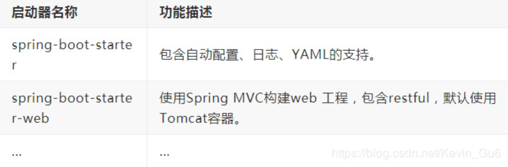
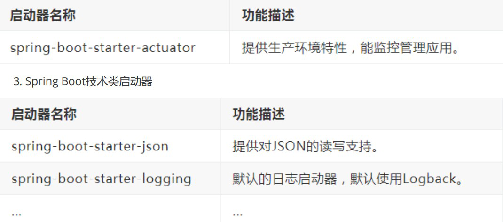
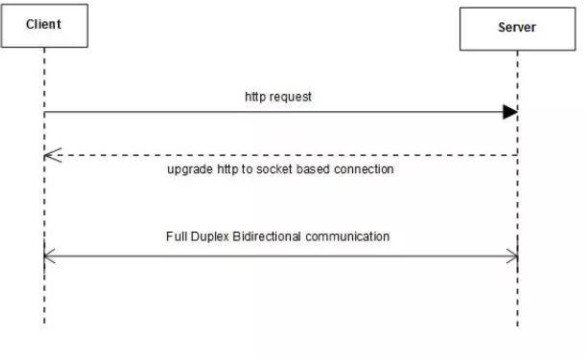

# SpringBoot面试题


~~[说明：提供正版免费激活下载，以及激活工具和教程，点击获取](http://www.idejihuo.com)~~

[](http://www.idejihuo.com)


- [SpringBoot面试题](#springboot面试题)
  - [目录](#目录)
    - [1、什么是 Spring Boot？](#1什么是-spring-boot)
    - [2、为什么要用SpringBoot](#2为什么要用springboot)
    - [3、Spring Boot 有哪些优点？](#3spring-boot-有哪些优点)
    - [4、Spring Boot 的核心注解是哪个？它主要由哪几个注解组成的？](#4spring-boot-的核心注解是哪个它主要由哪几个注解组成的)
    - [5、运行Spring Boot有哪几种方式](#5运行spring-boot有哪几种方式)
    - [6、如何理解 Spring Boot 中的 Starters？](#6如何理解-spring-boot-中的-starters)
    - [7、如何在Spring Boot启动的时候运行一些特定的代码？](#7如何在spring-boot启动的时候运行一些特定的代码)
    - [8、Spring Boot 需要独立的容器运行吗？](#8spring-boot-需要独立的容器运行吗)
    - [9、Spring Boot中的监视器是什么？](#9spring-boot中的监视器是什么)
    - [10、如何使用Spring Boot实现异常处理？](#10如何使用spring-boot实现异常处理)
    - [11、你如何理解 Spring Boot 中的 Starters](#11你如何理解-spring-boot-中的-starters)
    - [12、springboot常用的starter有哪些](#12springboot常用的starter有哪些)
    - [13、SpringBoot 实现热部署有哪几种方式](#13springboot-实现热部署有哪几种方式)
    - [14、如何理解 Spring Boot 配置加载顺序](#14如何理解-spring-boot-配置加载顺序)
    - [15、Spring Boot 的核心配置文件有哪几个？它们的区别是什么？](#15spring-boot-的核心配置文件有哪几个它们的区别是什么)
    - [16、如何集成 Spring Boot 和 ActiveMQ](#16如何集成-spring-boot-和-activemq)
    - [17、什么是 JavaConfig？](#17什么是-javaconfig)
    - [18、如何重新加载 Spring Boot 上的更改，而无需重新启动服务器？](#18如何重新加载-spring-boot-上的更改而无需重新启动服务器)
    - [19、Spring Boot 中的监视器是什么？](#19spring-boot-中的监视器是什么)
    - [20、如何在 Spring Boot 中禁用 Actuator 端点安全性？](#20如何在-spring-boot-中禁用-actuator-端点安全性)
    - [21、如何在自定义端口上运行 Spring Boot 应用程序？](#21如何在自定义端口上运行-spring-boot-应用程序)
    - [22、什么是 YAML？](#22什么是-yaml)
    - [23、如何实现 Spring Boot 应用程序的安全性？](#23如何实现-spring-boot-应用程序的安全性)
    - [24、如何集成 Spring Boot 和 ActiveMQ？](#24如何集成-spring-boot-和-activemq)
    - [25、如何使用 Spring Boot 实现分页和排序？](#25如何使用-spring-boot-实现分页和排序)
    - [26、什么是 Swagger？你用 Spring Boot 实现了它吗？](#26什么是-swagger你用-spring-boot-实现了它吗)
    - [27、什么是 Spring Profiles？](#27什么是-spring-profiles)
    - [28、什么是 Spring Batch？](#28什么是-spring-batch)
    - [29、什么是 FreeMarker 模板？](#29什么是-freemarker-模板)
    - [30、如何使用 Spring Boot 实现异常处理？](#30如何使用-spring-boot-实现异常处理)
    - [31、您使用了哪些 starter maven 依赖项？](#31您使用了哪些-starter-maven-依赖项)
    - [32、什么是 CSRF 攻击？](#32什么是-csrf-攻击)
    - [33、什么是 WebSockets？](#33什么是-websockets)
    - [34、什么是 AOP？](#34什么是-aop)
    - [35、什么是 Apache Kafka？](#35什么是-apache-kafka)
    - [36、我们如何监视所有 Spring Boot 微服务？](#36我们如何监视所有-spring-boot-微服务)
    - [37、Spring Boot 的配置文件有哪几种格式？它们有什么区别？](#37spring-boot-的配置文件有哪几种格式它们有什么区别)
    - [38、开启 Spring Boot 特性有哪几种方式？](#38开启-spring-boot-特性有哪几种方式)
    - [39、Spring Boot 的目录结构是怎样的？](#39spring-boot-的目录结构是怎样的)
    - [40、运行 Spring Boot 有哪几种方式？](#40运行-spring-boot-有哪几种方式)
    - [41、Spring Boot 自动配置原理是什么？](#41spring-boot-自动配置原理是什么)
    - [42、如何在 Spring Boot 启动的时候运行一些特定的代码？](#42如何在-spring-boot-启动的时候运行一些特定的代码)
    - [43、Spring Boot 有哪几种读取配置的方式？](#43spring-boot-有哪几种读取配置的方式)
    - [44、Spring  Boot  支持哪些日志框架？推荐和默认的日志框架是哪个？](#44spring--boot--支持哪些日志框架推荐和默认的日志框架是哪个)
    - [45、Spring Boot 如何定义多套不同环境配置？](#45spring-boot-如何定义多套不同环境配置)
    - [46、Spring Boot 可以兼容老 Spring 项目吗，如何做？](#46spring-boot-可以兼容老-spring-项目吗如何做)
    - [47、保护 Spring Boot 应用有哪些方法？](#47保护-spring-boot-应用有哪些方法)
    - [48、Spring Boot 2.X 有什么新特性？与 1.X 有什么区别？](#48spring-boot-2x-有什么新特性与-1x-有什么区别)
    - [49、如何重新加载Spring Boot上的更改，而无需重新启动服务器？](#49如何重新加载spring-boot上的更改而无需重新启动服务器)
    - [50、springboot集成mybatis的过程](#50springboot集成mybatis的过程)
    - [更多...](#更多)


---


## 目录

### 1、什么是 Spring Boot？
多年来， 随着新功能的增加 ，spring 变得越来越复杂。 只需访问https://spring.io/projects 页面 ，我们就会 看到可以在我们的应用程序中使用的所有 Spring 项目的不同功能。 如果必须启动 一个新的 Spring 项目 ，我们必 须添加构建路径或添加 Maven 依赖关系 ，配置应用程序服务器 ，添加 spring 配置 。因此 ，开始一个新的 spring 项目需要很多努力 ，因为我们现在必须从头开始做所有事情。

Spring Boot 是解 决这 个问 题的 方法 。Spring Boot 已经 建立 在现 有 spring 框架之上 。使用 spring 启动 ，我们 避免 了之 前我 们必 须做 的所 有样 板代 码和 配置 。因此， Spring Boot 可以 帮助 我们 以最 少的 工作 量， 更加 健壮 地使 用现 有的 Spring功能


### 2、为什么要用SpringBoot
Spring Boot 优点非常多，如：

**一、独立运行**

Spring Boot而且内嵌了各种servlet容器，Tomcat、Jetty等，现在不再需要打成war包部署到容器中，Spring Boot只要打成一个可执行的jar包就能独立运行，所有的依赖包都在一个jar包内。

**二、简化配置**

spring-boot-starter-web启动器自动依赖其他组件，简少了maven的配置。

**三、自动配置**

Spring  Boot能根据当前类路径下的类、jar包来自动配置bean，如添加一个spring-boot-starter-web启动器就能拥有web的功能，无需其他配置。

**四、无代码生成和XML配置**

Spring Boot配置过程中无代码生成，也无需XML配置文件就能完成所有配置工作，这一切都是借助于条件注解完成的，这也是Spring4.x的核心功能之一。

**五、应用监控**

Spring Boot提供一系列端点可以监控服务及应用，做健康检测


### 3、Spring Boot 有哪些优点？

Spring Boot 的优点有：

1) 减少开发，测试时间和努力。
2) 使用 JavaConfig 有助于避免使用 XML。
3) 避免大量的 Maven 导入和各种版本冲突。
4) 提供意见发展方法。
5) 通过提供默认值快速开始开发。
6) 没有单独的 Web 服务器需要。这意味着你不再需要启动 Tomcat，Glassfish或其他任何东西。
7) 需要更少的配置 因为没有 web.xml 文件。只需添加用@ Configuration 注释的类，然后添加用@Bean 注释的方法，Spring 将自动加载对象并像以前一样对其进行管理。您甚至可以将@Autowired 添加到 bean 方法中，以使 Spring 自动装入需要的依赖关系中。
8) 基于环境的配置 使用这些属性，您可以将您正在使用的环境传递到应用程序：```-Dspring.profiles.active = {enviornment}```。在加载主应用程序属性文件后，Spring 将在```（application{environment} .properties）```中加载后续的应用程序属性文件。

### 4、Spring Boot 的核心注解是哪个？它主要由哪几个注解组成的？

启动类上面的注解是@SpringBootApplication，它也是 Spring Boot 的核心注解，主要组合包含了以下
3 个注解：
- @SpringBootConfiguration：组合了 @Configuration 注解，实现配置文件的功能。
- @EnableAutoConfiguration：打开自动配置的功能，也可以关闭某个自动配置的选项，如关闭数据源自动配置功能： @SpringBootApplication(exclude = { DataSourceAutoConfiguration.class })。
- @ComponentScan：Spring组件扫描

### 5、运行Spring Boot有哪几种方式
1) 打包用命令或者放到容器中运行
2) 用 Maven/Gradle 插件运行
3) 直接执行 main 方法运行


### 6、如何理解 Spring Boot 中的 Starters？

**Starters是什么：**

Starters可以理解为启动器，它包含了一系列可以集成到应用里面的依赖包，你可以一站式集成Spring及其他技术，而不需要到处找示例代码和依赖包。如你想使用Spring JPA访问数据库，只要加入springboot-starter-data-jpa启动器依赖就能使用了。Starters包含了许多项目中需要用到的依赖，它们能快速持续的运行，都是一系列得到支持的管理传递性依赖。

**Starters命名：**

Spring Boot官方的启动器都是以spring-boot-starter-命名的，代表了一个特定的应用类型。第三方的启动器不能以spring-boot开头命名，它们都被Spring  Boot官方保留。一般一个第三方的应该这样命名，像mybatis的```mybatis-spring-boot-starter```。

Starters分类：

1) Spring Boot应用类启动器

[](http://www.idejihuo.com)

2) Spring Boot生产启动器

[](http://www.idejihuo.com)


3) 其他第三方启动器

### 7、如何在Spring Boot启动的时候运行一些特定的代码？
如果你想在Spring  Boot启动的时候运行一些特定的代码，你可以实现接口ApplicationRunner或者CommandLineRunner，这两个接口实现方式一样，它们都只提供了一个run方法。CommandLineRunner：启动获取命令行参数


### 8、Spring Boot 需要独立的容器运行吗？
可以不需要，内置了 Tomcat/ Jetty 等容器


### 9、Spring Boot中的监视器是什么？
Spring boot actuator是spring启动框架中的重要功能之一。Spring  boot监视器可帮助您访问生产环境中正在运行的应用程序的当前状态。有几个指标必须在生产环境中进行检查和监控。即使一些外部应用程序可能正在使用这些服务来向相关人员触发警报消息。监视器模块公开了一组可直接作为HTTP URL访问的REST端点来检查状态


### 10、如何使用Spring Boot实现异常处理？
Spring提供了一种使用ControllerAdvice处理异常的非常有用的方法。 我们通过实现一个ControlerAdvice类，来处理控制器类抛出的所有异常


### 11、你如何理解 Spring Boot 中的 Starters
Starters可以理解为启动器，它包含了一系列可以集成到应用里面的依赖包，你可以一站式集成 Spring及其他技术，而不需要到处找示例代码和依赖包。如你想使用 Spring JPA 访问数据库，只要加入spring-boot-starter-data-jpa 启动器依赖就能使用了

### 12、springboot常用的starter有哪些
- spring-boot-starter-web 嵌入tomcat和web开发需要servlet与jsp支持
- spring-boot-starter-data-jpa 数据库支持
- spring-boot-starter-data-redis redis数据库支持
- spring-boot-starter-data-solr solr支持
- mybatis-spring-boot-starter 第三方的mybatis集成starter


### 13、SpringBoot 实现热部署有哪几种方式
主要有两种方式： 
- Spring Loaded
- Spring-boot-devtools


### 14、如何理解 Spring Boot 配置加载顺序
在 Spring Boot 里面，可以使用以下几种方式来加载配置。
1) properties文件； 
2) YAML文件；
3) 系统环境变量；
4) 命令行参数； 
5) 等等……


### 15、Spring Boot 的核心配置文件有哪几个？它们的区别是什么？
Spring Boot 的核心配置文件是 application 和 bootstrap 配置文件。application 配置文件这个容易理解，主要用于 Spring Boot 项目的自动化配置。bootstrap 配置文件有以下几个应用场景。

1) 使用 Spring Cloud Config 配置中心时，这时需要在 bootstrap 配置文件中添加连接到配置中心的配置属性来加载外部配置中心的配置信息；
2) 一些固定的不能被覆盖的属性；
3) 一些加密/解密的场景


### 16、如何集成 Spring Boot 和 ActiveMQ
对于集成 Spring Boot 和 ActiveMQ，我们使用spring-boot-starter-activemq依赖关系。 它只需要很少的配置，并且不需要样板代码


### 17、什么是 JavaConfig？
Spring JavaConfig 是 Spring 社区的产品，它提供了配置 Spring IoC 容器的纯Java 方法。因此它有助于避免使用 XML 配置。使用 JavaConfig 的优点在于：
1) 面向对象的配置。由于配置被定义为 JavaConfig 中的类，因此用户可以充分利用 Java 中的面向对象功能。一个配置类可以继承另一个，重写它的@Bean 方法等。
2) 减少或消除 XML 配置。基于依赖注入原则的外化配置的好处已被证明。但是，许多开发人员不希望在 XML 和 Java 之间来回切换。JavaConfig 为开发人员提供了一种纯 Java 方法来配置与 XML 配置概念相似的 Spring 容器。从技术角度来讲，只使用 JavaConfig 配置类来配置容器是可行的，但实际上很多人认为将JavaConfig 与 XML 混合匹配是理想的。
3) 类型安全和重构友好。JavaConfig 提供了一种类型安全的方法来配置 Spring容器。由于 Java 5.0 对泛型的支持，现在可以按类型而不是按名称检索 bean，不需要任何强制转换或基于字符串的查找。


### 18、如何重新加载 Spring Boot 上的更改，而无需重新启动服务器？
这可以使用 DEV 工具来实现。通过这种依赖关系，您可以节省任何更改，嵌入式tomcat 将重新启动。Spring Boot 有一个开发工具（DevTools）模块，它有助于提高开发人员的生产力。Java 开发人员面临的一个主要挑战是将文件更改自动部署到服务器并自动重启服务器。开发人员可以重新加载 Spring Boot 上的更改，而无需重新启动服务器。这将消除每次手动部署更改的需要。Spring Boot 在发布它的第一个版本时没有这个功能。这是开发人员最需要的功能。

DevTools 模块完全满足开发人员的需求。该模块将在生产环境中被禁用。它还提供 H2 数据库控制台以更好地测试应用程序。
```
<dependency>
<groupId>org.springframework.boot</groupId>
<artifactId>spring-boot-devtools</artifactId>
<optional>true</optional>
</dependency>
```


### 19、Spring Boot 中的监视器是什么？
Spring boot actuator 是 spring 启动框架中的重要功能之一。Spring boot 监视器可帮助您访问生产环境中正在运行的应用程序的当前状 态。有几个指标必须在生产环境中进行检查和监控。即使一些外部应用程序可能正在使用这些服务来向相关人员触发警报消息。监视器模块公开了一组可直接作为 HTTP URL 访问的REST 端点来检查状态。


### 20、如何在 Spring Boot 中禁用 Actuator 端点安全性？
默认情况下，所有敏感的 HTTP 端点都是安全的，只有具有 ACTUATOR 角色的用户才能访问它们。安全性是使用标准的HttpServletRequest.isUserInRole 方法实施的。 我们可以使用来禁用安全性。只有在执行机构端点在防火墙后访问时，才建议禁用安全性。


### 21、如何在自定义端口上运行 Spring Boot 应用程序？
为了在自定义端口上运行 Spring Boot 应用程序，您可以在application.properties 中指定端口。
```
server.port = 8090
```

### 22、什么是 YAML？
YAML 是一种人类可读的数据序列化语言。它通常用于配置文件。
与属性文件相比，如果我们想要在配置文件中添加复杂的属性，YAML 文件就更加结构化，而且更少混淆。可以看出 YAML 具有分层配置数据。


### 23、如何实现 Spring Boot 应用程序的安全性？
为了实现 Spring Boot 的安全性，我们使用 spring-boot-starter-security 依赖项，并且必须添加安全配置。它只需要很少的代码。配置类将必须扩展WebSecurityConfigurerAdapter 并覆盖其方法。


### 24、如何集成 Spring Boot 和 ActiveMQ？
对于集成 Spring Boot 和 ActiveMQ，我们使用
依赖关系。 它只需要很少的配置，并且不需要样板代码。


### 25、如何使用 Spring Boot 实现分页和排序？
使用 Spring Boot 实现分页非常简单。使用 Spring Data-JPA 可以实现将可分页的传递给存储库方法。


### 26、什么是 Swagger？你用 Spring Boot 实现了它吗？
Swagger 广泛用于可视化 API，使用 Swagger UI 为前端开发人员提供在线沙箱。Swagger 是用于生成 RESTful Web 服务的可视化表示的工具，规范和完整框架实现。它使文档能够以与服务器相同的速度更新。当通过 Swagger 正确定义时，消费者可以使用最少量的实现逻辑来理解远程服务并与其进行交互。因此，Swagger
消除了调用服务时的猜测。


### 27、什么是 Spring Profiles？
Spring Profiles 允许用户根据配置文件（dev，test，prod 等）来注册 bean。因此，当应用程序在开发中运行时，只有某些 bean 可以加载，而在 PRODUCTION中，某些其他 bean 可以加载。假设我们的要求是 Swagger 文档仅适用于 QA 环境，并且禁用所有其他文档。这可以使用配置文件来完成。Spring Boot 使得使用配置文件非常简单。


### 28、什么是 Spring Batch？
Spring Boot Batch 提供可重用的函数，这些函数在处理大量记录时非常重要，包括日志/跟踪，事务管理，作业处理统计信息，作业重新启动，跳过和资源管理。它还提供了更先进的技术服务和功能，通过优化和分区技术，可以实现极高批量和高性能批处理作业。简单以及复杂的大批量批处理作业可以高度可扩展的方式利用框架处理重要大量的信息。


### 29、什么是 FreeMarker 模板？
FreeMarker 是一个基于 Java 的模板引擎，最初专注于使用 MVC 软件架构进行动态网页生成。使用 Freemarker 的主要优点是表示层和业务层的完全分离。程序员可以处理应用程序代码，而设计人员可以处理 html 页面设计。最后使用freemarker 可以将这些结合起来，给出最终的输出页面。


### 30、如何使用 Spring Boot 实现异常处理？
Spring 提供了一种使用 ControllerAdvice 处理异常的非常有用的方法。 我们通过实现一个 ControlerAdvice 类，来处理控制器类抛出的所有异常。

### 31、您使用了哪些 starter maven 依赖项？
使用了下面的一些依赖项
这有助于增加更少的依赖关系，并减少版本的冲突。
```
spring-boot-starter-activemq 
spring-boot-starter-security
```


### 32、什么是 CSRF 攻击？
- CSRF 代表跨站请求伪造。这是一种攻击，迫使最终用户在当前通过身份验证的Web  应用程序上执行不需要的操作。
- CSRF 攻击专门针对状态改变请求，而不是数据窃取，因为攻击者无法查看对伪造请求的响应。

这有助于增加更少的依赖关系，并减少版本的冲突。


### 33、什么是 WebSockets？
WebSocket 是一种计算机通信协议，通过单个 TCP 连接提供全双工通信信道。

[](http://www.idejihuo.com)

1) WebSocket 是双向的 -使用 WebSocket 客户端或服务器可以发起消息发送。
2) WebSocket 是全双工的 -客户端和服务器通信是相互独立的。
3) 单个 TCP 连接 -初始连接使用 HTTP，然后将此连接升级到基于套接字的连接。然后这个单一连接用于所有未来的通信
4) Light 与 http 相比，WebSocket 消息数据交换要轻得多。


### 34、什么是 AOP？
在软件开发过程中，跨越应用程序多个点的功能称为交叉问题。这些交叉问题与应用程序的主要业务逻辑不同。因此，将这些横切关注与业务逻辑分开是面向方面编程（AOP）的地方。


### 35、什么是 Apache Kafka？
Apache Kafka 是一个分布式发布 - 订阅消息系统。它是一个可扩展的，容错的发布 - 订阅消息系统，它使我们能够构建分布式应用程序。这是一个 Apache 顶级项目。Kafka 适合离线和在线消息消费。


### 36、我们如何监视所有 Spring Boot 微服务？
Spring Boot 提供监视器端点以监控各个微服务的度量。这些端点对于获取有关应用程序的信息（如它们是否已启动）以及它们的组件（如数据库等）是否正常运行很有帮助。但是，使用监视器的一个主要缺点或困难是，我们必须单独打开应用程序的知识点以了解其状态或健康状况。想象一下涉及 50 个应用程序的微服务，管理员将不得不击中所有 50 个应用程序的执行终端。为了帮助我们处理这种情况，我们将使用位于的开源项目。 它建立在 Spring Boot Actuator 之上，它提供了一个 Web UI，使我们能够可视化多个应用程序的度量。


### 37、Spring Boot 的配置文件有哪几种格式？它们有什么区别？
.properties 和 .yml，它们的区别主要是书写格式不同。

1).properties
```
app.user.name = javastack
```
2).yml
```
app:
user:
name: javastack
```
另外，.yml 格式不支持 @PropertySource 注解导入配置。


### 38、开启 Spring Boot 特性有哪几种方式？
1) 继 承 spring-boot-starter-parent 项 目 
2) 导入spring-boot-dependencies项目依赖


### 39、Spring Boot 的目录结构是怎样的？
```
cn
+- javastack
+- MyApplication.java
|+- customer
|	+- Customer.java
|	+- CustomerController.java
|	+- CustomerService.java
|	+- CustomerRepository.java
|
+- order
+- Order.java
+- OrderController.java
+- OrderService.java
+- OrderRepository.java
```

这个目录结构是主流及推荐的做法，而在主入口类上加上 @SpringBootApplication 注解来开启 Spring Boot 的各项能力，如自动配置、组件扫描等。


### 40、运行 Spring Boot 有哪几种方式？
1) 打包用命令或者放到容器中运行
2) 用 Maven/ Gradle 插件运行
3) 直接执行 main 方法运行


### 41、Spring Boot 自动配置原理是什么？
注解 @EnableAutoConfiguration, @Configuration, @ConditionalOnClass 就是自动配置的核心，首先它得是一个配置文件，其次根据类路径下是否有这个类去自动配置。


### 42、如何在 Spring Boot 启动的时候运行一些特定的代码？
可以实现接口 ApplicationRunner 或者 CommandLineRunner，这两个接口实现方式一样，它们都只提供了一个 run 方法


### 43、Spring Boot 有哪几种读取配置的方式？
Spring Boot 可以通过 @PropertySource,@Value,@Environment, @ConfigurationProperties 来绑定变量


### 44、Spring  Boot  支持哪些日志框架？推荐和默认的日志框架是哪个？
Spring Boot 支持 Java Util Logging, Log4j2, Lockback 作为日志框架，如果你使用 Starters 启动器，Spring Boot 将使用 Logback 作为默认日志框架


### 45、Spring Boot 如何定义多套不同环境配置？
提供多套配置文件，如：
```
applcation.properties

application-dev.properties

application-test.properties

application-prod.properties
```
运行时指定具体的配置文件


### 46、Spring Boot 可以兼容老 Spring 项目吗，如何做？
可以兼容，使用 @ImportResource 注解导入老 Spring 项目配置文件。


### 47、保护 Spring Boot 应用有哪些方法？
- 在生产中使用HTTPS
- 使用Snyk检查你的依赖关系
- 升级到最新版本
- 启用CSRF保护
- 使用内容安全策略防止XSS攻击
- …


### 48、Spring Boot 2.X 有什么新特性？与 1.X 有什么区别？

- 配置变更
- JDK 版本升级
- 第三方类库升级
- 响应式 Spring 编程支持
- HTTP/2 支持
- 配置属性绑定
- 更多改进与加强…


### 49、如何重新加载Spring Boot上的更改，而无需重新启动服务器？
这可以使用DEV工具来实现。通过这种依赖关系，您可以节省任何更改，嵌入式tomcat将重新启动。

Spring Boot有一个开发工具（DevTools）模块，它有助于提高开发人员的生产力。Java开发人员面临的一个主要挑战是将文件更改自动部署到服务器并自动重启服务器。

开发人员可以重新加载Spring Boot上的更改，而无需重新启动服务器。这将消除每次手动部署更改的需要。Spring Boot在发布它的第一个版本时没有这个功能。

这是开发人员最需要的功能。DevTools模块完全满足开发人员的需求。该模块将在生产环境中被禁用。它还提供H2数据库控制台以更好地测试应用程序。

```
org.springframework.boot spring-boot-devtools
true
```


### 50、springboot集成mybatis的过程
添加mybatis的starter maven依赖org.mybatis.spring.boot
mybatis-spring-boot-starter 1.2.0
在mybatis的接口中 添加@Mapper注解在application.yml配置数据源信息


### 更多...